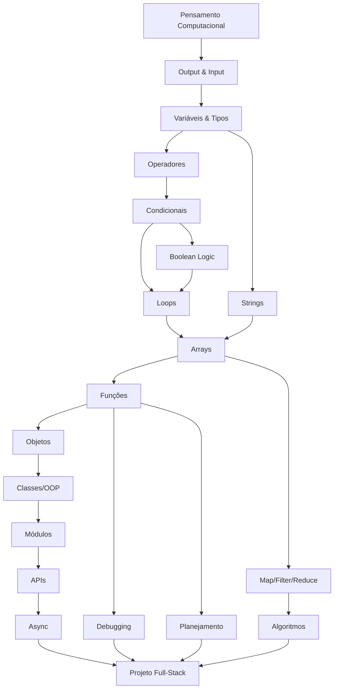

# 🧠 Metodologia Educacional Completa
## Plataforma de Ensino de Programação Inclusiva

> Documento de Referência Metodológica v1.0
> Última atualização: Maio 2026

---

# Índice

1. [Filosofia Educacional](#1-filosofia-educacional)
2. [Sistema para Neurotípicos](#2-sistema-para-neurotípicos)
3. [Sistema para Neuroatípicos](#3-sistema-para-neuroatípicos)
4. [Arquitetura das Aulas](#4-arquitetura-das-aulas)
5. [Ensino de Programação](#5-ensino-de-programação)
6. [Sistema Adaptativo](#6-sistema-adaptativo)
7. [UX Educacional](#7-ux-educacional)
8. [Sistema de Motivação](#8-sistema-de-motivação)
9. [Métricas e Dados](#9-métricas-e-dados)
10. [Arquitetura Metodológica Final](#10-arquitetura-metodológica-final)

---

# 1. FILOSOFIA EDUCACIONAL

## 1.1 Princípios Pedagógicos Centrais

### Princípio 1: Aprendizado Ativo (Active Learning)

**O que é:** Todo conhecimento é construído pelo aluno através da ação — nunca passivamente absorvido. Na plataforma, o aluno escreve código dentro dos primeiros 90 segundos de qualquer lição.

**Base científica:**
- **Freeman et al. (2014)**, meta-análise publicada em *PNAS* com 225 estudos: estudantes em aulas ativas tiveram notas 6% maiores e taxa de reprovação 1.5× menor do que em aulas expositivas tradicionais.
- **Chi & Wylie (2014)**, framework ICAP: atividades *construtivas* e *interativas* geram aprendizado significativamente superior a atividades *ativas* simples, que por sua vez superam *passivas*.

**Na plataforma:**
- Ratio mínimo de 60% prática / 40% teoria em toda lição.
- Nenhuma explicação teórica excede 3 minutos sem um exercício interativo.
- Code-along imediato após cada conceito.

**Problema que resolve:** Elimina a "ilusão de competência" — a falsa sensação de entender algo apenas por ter lido/assistido.

---

### Princípio 2: Carga Cognitiva Gerenciada (Cognitive Load Management)

**O que é:** O cérebro possui limites de processamento na memória de trabalho. Toda instrução deve ser desenhada para minimizar carga estranha (extraneous load), otimizar carga germânica (germane load) e nunca exceder a capacidade total.

**Base científica:**
- **Sweller (1988, 2011)**, Teoria da Carga Cognitiva: a memória de trabalho humana processa ~4±1 elementos simultâneos (Cowan, 2001). Instrução mal desenhada sobrecarrega esses limites.
- **Mayer (2009)**, 12 Princípios de Aprendizagem Multimídia: redundância, coerência, segmentação e pré-treinamento reduzem carga estranha.
- **Kalyuga (2007)**, Efeito de Reversão de Expertise: o que ajuda iniciantes (scaffolding pesado) prejudica avançados. A instrução deve se adaptar.

**Na plataforma:**
- Conceitos são apresentados UM de cada vez (single-concept lessons).
- Exemplos de código mostram apenas o conceito-alvo; todo código irrelevante é abstraído.
- Instruções textuais e visuais são complementares, nunca redundantes.
- Scaffolding é reduzido progressivamente conforme o aluno demonstra domínio (fading).

**Problema que resolve:** Evita overload cognitivo, que causa frustração, desistência e retenção zero.

---

### Princípio 3: Espaçamento e Intercalação (Spacing & Interleaving)

**O que é:** Distribuir prática ao longo do tempo e misturar tópicos relacionados produz aprendizado superior à prática massiva em bloco.

**Base científica:**
- **Ebbinghaus (1885/1913)**, Curva do Esquecimento: sem revisão, 70% do material é esquecido em 24h.
- **Cepeda et al. (2006)**, meta-análise: espaçamento aumenta retenção de longo prazo em até 100% comparado a estudo massivo.
- **Rohrer & Taylor (2007)**: intercalação de tópicos melhora desempenho em 43% em testes posteriores versus prática bloqueada.
- **Pimsleur (1967)**: intervalos graduados (1 dia → 3 dias → 7 dias → 14 dias → 30 dias) otimizam retenção.

**Na plataforma:**
- Algoritmo de repetição espaçada baseado em SM-2 modificado (Wozniak, 1990) integrado ao fluxo de exercícios.
- Exercícios de revisão são intercalados naturalmente entre novos conteúdos.
- "Flash reviews" de 2-3 minutos aparecem no início de cada sessão, cobrindo conceitos anteriores.
- O sistema nunca deixa um conceito "morrer" — ele retorna em contextos diferentes.

**Problema que resolve:** Transforma conhecimento de curto prazo em conhecimento permanente.

---

### Princípio 4: Recuperação Ativa (Retrieval Practice)

**O que é:** O ato de tentar lembrar informação fortalece a memória mais do que relê-la. Cada exercício é, fundamentalmente, uma oportunidade de retrieval.

**Base científica:**
- **Roediger & Butler (2011)**, Testing Effect: teste/retrieval é a estratégia de estudo mais poderosa conhecida pela ciência.
- **Karpicke & Blunt (2011)**: retrieval practice supera até elaboração e mapa conceitual em testes de transferência.
- **Agarwal et al. (2012)**: retrieval prática beneficia desproporcionalmente alunos de menor desempenho.

**Na plataforma:**
- Exercícios nunca são "copie este código". São sempre "resolva este problema usando o que aprendeu".
- Checkpoints pedem que o aluno explique conceitos em suas próprias palavras (generation effect).
- Problemas são apresentados ANTES da explicação em módulos avançados (productive failure — Kapur, 2008).

---

### Princípio 5: Feedback Imediato e Específico

**O que é:** Feedback deve ser dado o mais rápido possível, ser específico ao erro, e guiar sem dar a resposta direta.

**Base científica:**
- **Hattie & Timperley (2007)**, modelo de feedback: feedback eficaz responde a três perguntas — Para onde vou? (feed up), Como estou indo? (feed back), Para onde vou agora? (feed forward).
- **Shute (2008)**: feedback elaborado (com explicação) supera feedback de verificação simples (certo/errado).
- **Van der Kleij et al. (2015)**: feedback imediato é superior para tarefas procedurais; feedback atrasado é superior para tarefas conceituais.

**Na plataforma:**
- Erros de sintaxe: feedback imediato inline com sugestão de correção.
- Erros lógicos: feedback progressivo em 3 níveis:
  1. **Nível 1 — Indicação:** "Algo não está certo no resultado. Olhe para a linha X."
  2. **Nível 2 — Dica:** "O valor esperado era Y, mas você obteve Z. Revise como a função W opera."
  3. **Nível 3 — Explicação:** "O erro ocorre porque... Veja o exemplo correto."
- O aluno escolhe o nível de ajuda (autonomia preservada).
- Feedback positivo é dado em marcos intermediários, não só na resposta final.

---

### Princípio 6: Motivação Intrínseca e Autodeterminação

**O que é:** Motivação duradoura emerge de três necessidades psicológicas básicas: autonomia, competência e pertencimento.

**Base científica:**
- **Deci & Ryan (1985, 2000)**, Teoria da Autodeterminação (SDT): motivação intrínseca é sustentável; motivação extrínseca pura (recompensas externas) pode minar interesse a longo prazo.
- **Pink (2009)**: autonomia, maestria e propósito como drivers de performance.
- **Csikszentmihalyi (1990)**: estado de Flow ocorre quando desafio e habilidade estão equilibrados.

**Na plataforma:**
- **Autonomia:** o aluno escolhe caminhos, ordem de certos conteúdos, e nível de dificuldade.
- **Competência:** feedback constante de progresso + dificuldade adaptativa mantêm desafio no sweet spot.
- **Pertencimento:** mesmo sem professores, a plataforma tem "voz" empática, celebra conquistas e normaliza erros.

---

### Princípio 7: Erro como Ferramenta Pedagógica

**O que é:** Erros não são fracassos — são o mecanismo mais poderoso de aprendizado quando acompanhados de feedback adequado.

**Base científica:**
- **Kapur (2008, 2014)**, Productive Failure: alunos que tentam resolver problemas antes de receberem instrução aprendem mais profundamente.
- **Metcalfe (2017)**: erros de alta confiança (quando o aluno tem certeza que está certo mas erra) geram o maior aprendizado quando corrigidos.
- **Dweck (2006)**, Growth Mindset: a crença de que habilidades são desenvolvíveis (vs. fixas) prediz resiliência e performance.

**Na plataforma:**
- A interface nunca diz "ERRADO" em vermelho com som de alarme.
- Mensagens de erro usam linguagem de processo: "Quase lá!", "Interessante — vamos investigar por que não funcionou."
- Cada erro é uma oportunidade: "Esse erro acontece com frequência quando [explicação]. Agora você sabe como evitá-lo."
- Growth Mindset é reforçado sistematicamente: "Você não sabia isso ontem. Agora sabe."

---

## 1.2 Filosofia de Ensino: O Modelo ASCEND

A plataforma segue o modelo **ASCEND**:

| Letra | Princípio | Descrição |
|-------|-----------|-----------|
| **A** | **Adaptive** | A experiência se adapta ao aluno, nunca o contrário |
| **S** | **Scaffolded** | Suporte progressivo que é removido conforme o domínio aumenta |
| **C** | **Contextual** | Todo conceito é ensinado dentro de um contexto real de uso |
| **E** | **Error-positive** | Erros são celebrados como mecanismo de aprendizado |
| **N** | **Neuroscience-informed** | Cada decisão de design é baseada em evidência neurocientífica |
| **D** | **Dignity-preserving** | Respeito absoluto pela inteligência e dignidade do aluno |

## 1.3 Estratégias Anti-Frustração

| Estratégia | Implementação | Base Científica |
|------------|---------------|-----------------|
| **Redução de ambiguidade** | Instruções são precisas, com exemplos do resultado esperado | Sweller (2011) — carga estranha |
| **Progressão micro** | Vitórias a cada 2-5 minutos | Dopamina — Schultz (1997) |
| **Safe fail** | Sandbox ilimitada sem consequências | Kapur (2014) — productive failure |
| **Escape hatches** | Pode pular, voltar, pedir ajuda a qualquer momento | Deci & Ryan (2000) — autonomia |
| **Normalização de dificuldade** | "Este é um dos conceitos mais desafiantes. Muitos alunos precisam de 3 tentativas." | Dweck (2006) — growth mindset |
| **Zero deadlines punitivos** | Sem timers na tela, sem contagem regressiva, sem "você perdeu" | Anxiety reduction — Eysenck (2007) |

## 1.4 Estratégias Anti-Abandono

| Momento de Risco | Sinal Detectável | Intervenção |
|------------------|-------------------|-------------|
| Primeira semana | Não retorna após 48h | Notificação gentil: "Seu progresso está salvo. 2 minutos bastam para a próxima lição." |
| Após primeiro erro complexo | Múltiplas tentativas falhadas sem avanço | Ativar modo guiado: reduzir dificuldade, oferecer dica proativa |
| Platô de progresso | Velocidade de conclusão cai >50% | Recalibrar dificuldade; oferecer caminho alternativo |
| Retorno após ausência longa | >7 dias sem login | Sessão de "warm-up" que recapitula os últimos conceitos dominados |
| Sobrecarga cognitiva | Tempo na tela >45 min + erros crescentes | Sugerir pausa com mensagem positiva sobre o progresso feito |

## 1.5 Como Ensinar Programação para Iniciantes Absolutos

**Princípio-chave: Concretude antes de abstração (Bruner, 1966)**

1. **Fase Enativa:** O aluno manipula elementos visuais (blocos, diagramas) para construir lógica.
2. **Fase Icônica:** O aluno vê a representação visual ao lado do código equivalente.
3. **Fase Simbólica:** O aluno escreve código puro.

**Na plataforma:**
- As primeiras 5 lições usam metáforas visuais: "Uma variável é como uma caixa com nome. Vamos dar um nome e colocar algo dentro."
- Código é mostrado com anotações visuais (setas, destaques coloridos, tooltips).
- Conceitos abstratos (loops, condições) são primeiro demonstrados com animações visuais do fluxo de execução antes de qualquer código.

---

# 2. SISTEMA PARA NEUROTÍPICOS

## 2.1 Estrutura das Aulas

### Formato: Aula Modular Progressiva (AMP)

Cada aula é dividida em **blocos de aprendizado** de **7-12 minutos**, alinhados com a curva de atenção sustentada (Bunce et al., 2010 — atenção em aula cai significativamente após 10-18 minutos).

```
┌─────────────────────────────────────────────────────┐
│                  SESSÃO DE ESTUDO                    │
│                   (25-40 min)                        │
│                                                      │
│  ┌──────────┐  ┌──────────┐  ┌──────────┐           │
│  │ Bloco 1  │→ │ Bloco 2  │→ │ Bloco 3  │           │
│  │ 7-12min  │  │ 7-12min  │  │ 7-12min  │           │
│  └──────────┘  └──────────┘  └──────────┘           │
│       ↑              ↑              ↑                │
│    Conceito A    Conceito B    Integração            │
│  + exercício    + exercício    + projeto              │
│                                                      │
│  [Flash Review 2min] ──────────→ [Checkpoint] ──→    │
│                                  [Recompensa]        │
└─────────────────────────────────────────────────────┘
```

### Estrutura Interna de Cada Bloco (7-12 min)

| Fase | Duração | Atividade | Propósito |
|------|---------|-----------|-----------|
| **Hook** | 30-60s | Pergunta provocativa ou demonstração de resultado final | Ativa curiosidade e contexto (Berlyne, 1960) |
| **Explicação** | 2-3 min | Conceito único com exemplo visual + código comentado | Carga cognitiva gerenciada |
| **Code-Along** | 2-3 min | Aluno replica/modifica o exemplo com orientação | Encoding motor + cognitivo |
| **Prática Guiada** | 2-3 min | Exercício com scaffolding (partes preenchidas) | Transfer próximo |
| **Micro-Check** | 30-60s | Pergunta rápida ou exercício mínimo | Retrieval practice |

## 2.2 Tempo Ideal

| Métrica | Valor Recomendado | Base |
|---------|-------------------|------|
| Sessão total | 25-40 min (padrão) | Pomodoro adaptado; curva de atenção |
| Bloco individual | 7-12 min | Bunce et al. (2010) |
| Máximo diário recomendado | 90 min (2-3 sessões) | Ericsson (1993) — prática deliberada |
| Intervalo entre sessões | ≥5 min | Consolidação; reset atencional |

## 2.3 Densidade de Informação

**Regra dos 3C: Um Conceito, Um Contexto, Um Código por bloco.**

- Máximo de **1 conceito novo** por bloco de 7-12 min.
- Máximo de **3 conceitos novos** por sessão.
- Cada conceito deve ter **≥2 exemplos** e **≥1 exercício** antes de avançar.
- Vocabulário técnico novo: máximo de **5 termos por sessão**, sempre com definição inline.

**Justificativa:** Miller (1956) — 7±2 itens na memória de trabalho; Cowan (2001) revisou para 4±1 chunks. Para iniciantes em programação, cada conceito ocupa múltiplos slots porque ainda não foi "chunked".

## 2.4 Sistema de Exercícios

### Taxonomia de Exercícios (ordenados por complexidade cognitiva — Bloom, 1956)

| Nível | Tipo | Exemplo | Quando Usar |
|-------|------|---------|-------------|
| 1 — Lembrar | **Fill-the-gap** | Complete a linha: `let nome = ___` | Imediatamente após explicação |
| 2 — Entender | **Predição** | "O que este código imprime?" | Após code-along |
| 3 — Aplicar | **Modificação** | "Altere o código para imprimir em maiúsculas" | Prática guiada |
| 4 — Analisar | **Debugging** | "Encontre e corrija o erro" | Após ≥2 exercícios de aplicação |
| 5 — Avaliar | **Comparação** | "Qual das duas soluções é mais eficiente? Por quê?" | Módulos intermediários+ |
| 6 — Criar | **Projeto livre** | "Crie um programa que faça X" | Fim de módulo |

### Regra de Progressão de Exercícios
```
Lembrar → Entender → Aplicar → [Checkpoint de Domínio] → Analisar → Criar
```
O aluno só avança quando demonstra domínio nos níveis anteriores (Mastery Learning — Bloom, 1968).

## 2.5 Sistema de Recompensas

| Recompensa | Frequência | Mecânica | Propósito |
|------------|------------|----------|-----------|
| ✨ **Micro-celebração** | A cada exercício correto | Animação sutil + mensagem | Dopamina imediata (Schultz, 1997) |
| 🏅 **Badge de conceito** | A cada conceito dominado | Badge visual no perfil | Senso de progresso |
| 📊 **Barra de progresso** | Visível sempre | Preenchimento visual gradual | Efeito de progresso endowed (Nunes & Dreze, 2006) |
| 🔥 **Streak** | Diário | Dias consecutivos de estudo (≥5 min conta) | Consistência (mas sem punição por quebra) |
| 🏆 **Milestone** | A cada módulo completo | Celebração maior + resumo de conquistas | Senso de realização |
| 🎯 **Projeto completado** | Fim de módulo | Certificado de projeto + portfolio | Competência tangível |

## 2.6 Progressão

### Modelo de Progressão: Espiral de Bruner Adaptada

Conceitos retornam em níveis crescentes de complexidade:

```
Nível 1: Variáveis simples (string, number)
         ↓
Nível 2: Variáveis em condicionais
         ↓
Nível 3: Variáveis em loops
         ↓
Nível 4: Variáveis em funções (escopo)
         ↓
Nível 5: Variáveis em objetos/classes
```

O mesmo conceito é revisitado **4-5 vezes** ao longo do curso, cada vez mais profundamente.

## 2.7 Repetição Espaçada: Algoritmo CORAL

**C**oncept-**O**riented **R**eview **A**lgorithm with **L**apse-tracking

```
Intervalos base: 1 dia → 3 dias → 7 dias → 14 dias → 30 dias → 90 dias

Ajustes:
- Resposta correta imediata: intervalo × 2.5
- Resposta correta com hesitação: intervalo × 1.5
- Resposta incorreta: reset para 1 dia, marcar como "frágil"
- Conceito "frágil" 2× consecutivas: ativar mini-aula de revisão
```

**Implementação na plataforma:**
- Flash reviews de 2-3 minutos no início de cada sessão.
- Exercícios de revisão são intercalados entre exercícios novos (ratio 30% revisão / 70% novo).
- O aluno nunca percebe que está "revisando" — os exercícios de revisão aparecem em novos contextos.

## 2.8 Engajamento, Consistência e Anti-Procrastinação

### Estratégias de Engajamento

| Estratégia | Implementação | Base |
|------------|---------------|------|
| **Narrativa** | Cada módulo tem uma "missão" contextual (ex: "Construir um quiz interativo") | Storytelling aumenta retenção (Graesser & Ottati, 1995) |
| **Progresso visível** | Mapa de jornada com nós desbloqueados | Goal gradient effect (Kivetz et al., 2006) |
| **Curiosity gap** | Preview do próximo conceito no final de cada lição | Loewenstein (1994) — information gap theory |
| **Variação** | Alternância entre tipos de exercícios a cada 3-5 min | Habituation prevention |
| **Relevância** | Cada conceito mostra uso real ("Isso é usado no Instagram para...") | Expectancy-value theory (Wigfield & Eccles, 2000) |

### Estratégias Anti-Procrastinação

| Estratégia | Implementação | Base |
|------------|---------------|------|
| **Regra dos 2 minutos** | "Faça só 1 exercício" — começar é mais difícil que continuar | Redução de ativação (Steel, 2007) |
| **Sessão mínima** | 5 minutos de flash review conta como sessão | Redução de barreira de entrada |
| **Preparação automática** | Ao abrir a plataforma, já está na próxima lição (sem menus de navegação obrigatórios) | Redução de decision fatigue |
| **Commitment devices** | "Defina seu horário de estudo" (lembrete gentil, sem punição) | Implementação de intenção (Gollwitzer, 1999) |
| **Quick wins** | Primeiros 2 exercícios de cada sessão são fáceis (revisão) | Momentum psicológico |

---

# 3. SISTEMA PARA NEUROATÍPICOS

> [!IMPORTANT]
> **Princípio fundamental:** Neurodivergência não é deficiência intelectual. É uma configuração cognitiva diferente que requer estratégias pedagógicas adaptadas — não simplificadas. A plataforma adapta a ENTREGA, não o CONTEÚDO. O destino é o mesmo; o caminho é personalizado.

## 3.1 Framework Unificado: Modelo BRIDGE

**B**rain-**R**esponsive **I**nclusive **D**esign for **G**enuine **E**ngagement

O modelo reconhece que cada perfil neurodivergente tem necessidades distintas mas com sobreposições significativas. Em vez de "modos" separados, a plataforma oferece um conjunto de **ajustes contínuos** que o aluno pode configurar e que o sistema adapta automaticamente.

### Eixos de Personalização

```
┌──────────────────────────────────────────────────────┐
│              EIXOS DE PERSONALIZAÇÃO                  │
│                                                       │
│  Estimulação ◄──────────●──────────► Calma            │
│  (alto estímulo)              (baixo estímulo)        │
│                                                       │
│  Estrutura   ◄──────────●──────────► Flexibilidade    │
│  (rotina fixa)              (exploração livre)        │
│                                                       │
│  Detalhamento ◄─────────●──────────► Visão Geral      │
│  (passo a passo)             (big picture)            │
│                                                       │
│  Feedback    ◄──────────●──────────► Silêncio          │
│  (constante)                 (sob demanda)            │
│                                                       │
│  Tempo       ◄──────────●──────────► Ritmo Livre       │
│  (blocos fixos)              (sem timer)              │
└──────────────────────────────────────────────────────┘
```

## 3.2 TDAH — Estratégias Específicas

### 3.2.1 Compreendendo o Perfil TDAH

O TDAH envolve diferenças na regulação de dopamina no córtex pré-frontal (Volkow et al., 2009), afetando:
- **Atenção sustentada** (dificuldade em manter foco em tarefas com baixa recompensa)
- **Função executiva** (planejamento, organização, início de tarefas)
- **Memória de trabalho** (Kasper et al., 2012)
- **Regulação emocional** (Barkley, 2015)
- **Percepção temporal** (Noreika et al., 2013)

**Crucial:** TDAH NÃO é falta de atenção. É dificuldade de REGULAÇÃO de atenção. Pessoas com TDAH frequentemente demonstram hiperfoco em tarefas de alto interesse — programação pode ser uma dessas tarefas.

### 3.2.2 Estrutura de Aula para TDAH

| Componente | Especificação | Justificativa |
|------------|---------------|---------------|
| **Duração do bloco** | 5-8 min (vs. 7-12 para neurotípicos) | Atenção sustentada reduzida (Barkley, 2015) |
| **Sessão total** | 15-25 min (com opção de continuar) | Prevenir fadiga; permitir hiperfoco se surgir |
| **Transições** | Micro-animação + som sutil entre blocos | Reset atencional; novelty seeking (Zald et al., 2008) |
| **Exercícios** | Resultado visível em <30 segundos | Feedback loop rápido = dopamina (Schultz, 1997) |
| **Variedade** | Alternar tipo de exercício a cada 2-3 min | Prevenção de habituation |
| **Início de tarefa** | Pré-preenchido com código parcial + instrução de 1 frase | Reduz inércia de início (Barkley, 2015) |

### 3.2.3 Estratégias de Dopamina

```
┌─────────────────────────────────────────────────┐
│           CICLO DE DOPAMINA OTIMIZADO            │
│                                                  │
│  [Novelty] → [Quick Win] → [Surprise] → [Loop]  │
│      ↓            ↓            ↓           ↓     │
│  Novo visual   Resposta     Recompensa   Volta   │
│  ou formato    correta      inesperada   ao      │
│  de exercício  imediata     (variável)   início  │
│                                                  │
│  Frequência: novo estímulo a cada 60-90 segundos │
└─────────────────────────────────────────────────┘
```

- **Recompensas variáveis** (ratio variável, Skinner — mas sem manipulação): às vezes uma animação especial, às vezes uma curiosidade sobre o conceito, às vezes um easter egg de código.
- **Progress bars que se movem visivelmente**: cada sub-passo move a barra (não só a resposta final).
- **Streak visual dinâmico**: animação que cresce com acertos consecutivos (mas sem punição por erros).

### 3.2.4 Gerenciamento de Hiperfoco

| Sinal | Detecção | Ação |
|-------|----------|------|
| Sessão >60 min contínua | Timer interno | Pausa sugerida gentilmente: "Você está arrasando! Que tal uma pausa de 5 min para maximizar a retenção?" |
| Sessão >90 min contínua | Timer interno | Pausa mais enfática: "Seu cérebro precisa de descanso para consolidar o que aprendeu. Salvamos seu progresso." |
| Sessão >120 min | Timer interno | Alerta com dado científico: "Estudos mostram que após 90 min, a retenção cai. Volte amanhã mais forte." |

**Importante:** NUNCA forçar pausa. NUNCA bloquear acesso. Apenas informar e sugerir.

### 3.2.5 Dificuldade de Início de Tarefa

A "paralisia de início" é um dos maiores desafios do TDAH. Estratégias:

| Estratégia | Implementação |
|------------|---------------|
| **Micro-primeiro-passo** | "Só clique 'Iniciar' — o exercício já está preparado" |
| **Código pré-escrito** | Template com 80% pronto; aluno preenche 20% |
| **Instrução de 1 frase** | "Mude o valor de X para Y" — zero ambiguidade |
| **Countdown de cortesia** | "Começando em 3... 2... 1..." (cria momentum externo) |
| **Warm-up** | Primeiro exercício sempre é revisão fácil (quick win) |

### 3.2.6 Memória de Trabalho

| Estratégia | Implementação | Base |
|------------|---------------|------|
| **Cheat sheets visuais** | Painel lateral com sintaxe e conceitos relevantes | Reduz carga na memória de trabalho |
| **Highlighted code** | Partes relevantes do código são destacadas | Atenção seletiva assistida |
| **Instrução visual** | Diagramas de fluxo ao lado do código | Dual coding (Paivio, 1986) |
| **Contexto persistente** | "Lembrete: você está aprendendo loops FOR" | Reancoramento contextual |

---

## 3.3 Autismo — Estratégias Específicas

### 3.3.1 Compreendendo o Perfil

O autismo envolve diferenças em:
- **Processamento sensorial** (hiper ou hipo-sensibilidade — Marco et al., 2011)
- **Função executiva** (mudança de tarefa, flexibilidade — Hill, 2004)
- **Processamento de informação** (preferência por detalhes e sistematização — Baron-Cohen, 2009)
- **Comunicação** (preferência por precisão e literalidade)
- **Previsibilidade** (necessidade de estrutura e rotina)

**Crucial:** Muitas pessoas autistas têm afinidade natural com programação devido ao pensamento sistemático. A plataforma deve CAPITALIZAR essas forças, não focar em "deficits".

### 3.3.2 Estrutura de Aula para Autismo

| Componente | Especificação | Justificativa |
|------------|---------------|---------------|
| **Previsibilidade** | Estrutura EXATAMENTE igual em todas as aulas (mesmo padrão de blocos) | Reduz ansiedade de incerteza |
| **Agenda visível** | "Esta aula tem: 1. Conceito → 2. Exemplo → 3. Exercício → 4. Revisão" | Transparência estrutural |
| **Linguagem precisa** | Zero metáforas ambíguas; instruções literais | Processamento literal (Happé, 1997) |
| **Consistência visual** | Cores, fontes e layout NUNCA mudam inesperadamente | Previsibilidade sensorial |
| **Detalhamento** | Explicações podem ser expandidas com "Saiba mais" | Atenção a detalhes (Baron-Cohen, 2009) |
| **Sem surpresas** | Preview de cada próximo passo antes de acontecer | Redução de ansiedade |

### 3.3.3 Processamento Sensorial

| Ajuste | Implementação |
|--------|---------------|
| **Sem animações automáticas** | Todas as animações são opt-in; o aluno liga se quiser |
| **Paleta restrita** | Opção de "modo reduzido" com apenas 3-4 cores neutras |
| **Sem sons automáticos** | Todo áudio é opt-in |
| **Tipografia clean** | Fonte sem serif, espaçamento largo, sem itálico excessivo |
| **Contraste ajustável** | Slider de contraste de 50% a 100% |
| **Modo de foco extremo** | Remove TODA UI exceto o conteúdo central (sem sidebar, sem header, sem barra de progresso) |

### 3.3.4 Interesses Profundos e Sistematização

**Capitalizar forças:**
- Oferecer "deep dives" opcionais que exploram o porquê técnico profundo.
- "Como o computador realmente processa este loop?" — explicações detalhadas de como a máquina funciona.
- Taxonomias visuais de tipos, operadores, estruturas — organizadas sistematicamente.
- Documentação de referência completa disponível sempre (não esconder informação "para não confundir").

### 3.3.5 Flexibilidade Cognitiva

| Desafio | Estratégia |
|---------|-----------|
| Dificuldade em mudar de abordagem | "Existem 3 formas de resolver isto: A, B, C. Comece pela que preferir." |
| Resistência a "jeito errado" | Validar múltiplas soluções corretas, não só a esperada |
| Perfeccionismo | "Código funcional > código perfeito. Vamos primeiro fazer funcionar, depois otimizar." |

---

## 3.4 Dislexia — Estratégias Específicas

### 3.4.1 Compreendendo o Perfil

Dislexia envolve diferenças no processamento fonológico e ortográfico (Snowling, 2000), afetando:
- **Leitura de texto** (velocidade e precisão)
- **Decodificação de palavras novas** (vocabulário técnico de programação)
- **Memória verbal de curto prazo**
- **NÃO afeta:** inteligência, raciocínio lógico, pensamento visual

### 3.4.2 Adaptações para Dislexia

| Área | Adaptação | Justificativa |
|------|-----------|---------------|
| **Tipografia** | Fonte OpenDyslexic ou similar disponível; tamanho ≥16px; espaçamento entre linhas ≥1.5 | British Dyslexia Association guidelines |
| **Texto** | Parágrafos curtos (máx. 3 linhas); frases simples; sem blocos densos | Reduz carga de decodificação |
| **Código** | Syntax highlighting com cores fortes para diferenciar elementos | Compensação visual para processamento fonológico |
| **Vocabulário** | Termos técnicos com pronúncia (tooltip com áudio) + definição visual | Suporte fonológico |
| **Alternativas** | Opção de áudio narrado para TODA explicação textual | Bypass do canal de leitura |
| **Fundo** | Opção de overlay colorido (creme, azul claro, verde claro) | Wilkins (2003) — Irlen syndrome/visual stress |
| **Código fonte** | Fonte monospace com ligaduras claras (Fira Code, JetBrains Mono) | Diferenciação visual de caracteres similares |

### 3.4.3 Abordagem Pedagógica

- **Ensino multissensorial:** cada conceito é apresentado em 3+ modalidades (visual, textual, auditivo, cinestésico/interativo).
- **Mnemônicos visuais:** imagens memoráveis para conceitos-chave.
- **Vocabulário introduzido gradualmente:** máximo 3 termos novos por sessão (vs. 5 para neurotípicos).
- **NÃO simplificar o conteúdo:** adaptar a FORMA, não a PROFUNDIDADE.

---

## 3.5 Ansiedade — Estratégias Específicas

### 3.5.1 Compreendendo o Perfil

Ansiedade de performance em aprendizado envolve:
- **Ameaça percebida** ao ego/competência (Eysenck et al., 2007)
- **Preocupação excessiva com erro** (rumination)
- **Evitação de desafios** (medo de falhar)
- **Paralisia decisória** (overthinking)
- **Arousal fisiológico** que consome recursos da memória de trabalho

### 3.5.2 Ambiente Psicologicamente Seguro

| Princípio | Implementação |
|-----------|---------------|
| **Zero julgamento** | Sem rankings públicos; sem comparações com outros alunos |
| **Sem timers visíveis** | Nenhum exercício tem cronômetro na tela |
| **Tentativas ilimitadas** | Sem limite de tentativas; sem "3 vidas" |
| **Sem punição** | Errar NUNCA remove XP, progresso ou streaks |
| **Linguagem de processo** | "Tente novamente" vs. "Resposta errada" |
| **Normalização** | "67% dos alunos erram nesta parte na primeira vez" |
| **Escape sempre disponível** | Pular qualquer exercício a qualquer momento (com opção de voltar depois) |

### 3.5.3 Redução de Ansiedade Pré-Tarefa

```
Antes de qualquer exercício complexo, o sistema exibe:

┌─────────────────────────────────────────────┐
│  📝 Próximo exercício                       │
│                                              │
│  O que será pedido: Criar uma função         │
│  Dificuldade: ●●○○○ (2/5)                   │
│  Tempo médio dos alunos: ~3 minutos          │
│  Tentativas não tem limite                   │
│  Dicas disponíveis: 3                        │
│                                              │
│  [Começar quando estiver pronto]             │
└─────────────────────────────────────────────┘
```

**Justificativa:** Incerteza é o principal gatilho de ansiedade (Grupe & Nitschke, 2013). Transparência total sobre o que esperar reduz ansiedade significativamente.

### 3.5.4 Feedback para Perfil Ansioso

- **Evitar:** vermelho, ❌, sons de erro, "INCORRETO", shaking animation.
- **Usar:** amarelo/laranja suave, "Quase lá!", tom gentil e construtivo.
- **Sempre incluir:** o que o aluno fez CERTO antes de apontar o que precisa mudar.
- **Sandwich de feedback:** Positivo → Construtivo → Encorajamento.

---

## 3.6 Sobrecarga Cognitiva — Estratégias Específicas

### 3.6.1 Detecção de Sobrecarga

| Sinal | Indicador Mensurável | Severidade |
|-------|----------------------|------------|
| **Erros crescentes** | Taxa de erro sobe >50% vs. média do aluno | ⚠️ Média |
| **Tempo crescente** | Tempo por exercício sobe >100% vs. média | ⚠️ Média |
| **Inatividade** | >3 min sem interação em exercício | 🔴 Alta |
| **Retrocesso** | Aluno volta a errar conceitos já dominados | 🔴 Alta |
| **Padrão errático** | Respostas aleatórias/rápidas sem reflexão | 🔴 Alta |

### 3.6.2 Intervenções por Severidade

**Severidade Média:**
- Reduzir complexidade do próximo exercício em 1 nível.
- Ofertar dica proativa.
- Mensagem: "Vamos praticar um pouco mais este conceito antes de avançar."

**Severidade Alta:**
- Ativar "modo calmo": reduzir estímulos visuais, aumentar espaçamento.
- Oferecer pausa ativa: "Que tal uma pausa de 2 minutos? Quando voltar, vamos recapitular."
- Se persistir: sugerir encerrar a sessão. "Você fez ótimo progresso hoje. Descansar agora vai ajudar seu cérebro a consolidar o que aprendeu."

### 3.6.3 Prevenção de Sobrecarga

| Estratégia | Implementação |
|------------|---------------|
| **Chunking agressivo** | Nunca mais de 1 conceito por bloco |
| **Whitespace generoso** | Espaço visual entre elementos |
| **UI progressiva** | Mostrar apenas o necessário; esconder opções avançadas |
| **Saídas visíveis** | Botão "pausar" e "sair" sempre visíveis |
| **Preview de extensão** | "Esta lição tem 3 blocos de 5 minutos" — sem surpresas |

---

## 3.7 Princípios Transversais para Todos os Perfis Neuroatípicos

| Princípio | Implementação |
|-----------|---------------|
| **Personalização progressiva** | Na primeira sessão, o aluno configura preferências sensoriais. O sistema refina automaticamente com o tempo. |
| **Autonomia sobre ajustes** | TODA adaptação automática pode ser desligada pelo aluno |
| **Transparência** | "Reduzi a velocidade porque percebi que você pode estar cansado. Quer manter assim?" |
| **Sem rótulos** | A plataforma NUNCA diz "modo TDAH" ou "modo dislexia". Apenas oferece ajustes individuais. |
| **Dignidade** | Linguagem sempre respeitosa; nunca simplificação condescendente |
| **Forças, não deficits** | "Seu padrão de pensamento detalhista é excelente para debugging" |

---

# 4. ARQUITETURA DAS AULAS

## 4.1 Modelo Universal de Aula: Framework ARPERC

Cada aula segue o framework **A**bertura-**R**evisão-**P**resentação-**E**xercício-**R**eforço-**C**heckpoint.

```
┌──────────────────────────────────────────────────────────────┐
│                    FRAMEWORK ARPERC                           │
│                                                               │
│  ┌─────────┐  ┌─────────┐  ┌─────────┐  ┌─────────┐        │
│  │ABERTURA │→ │REVISÃO  │→ │PRESENT. │→ │EXERCÍCIO│        │
│  │ 1-2 min │  │ 2-3 min │  │ 3-5 min │  │ 5-8 min │        │
│  └─────────┘  └─────────┘  └─────────┘  └─────────┘        │
│       ↓                                        ↓             │
│  Hook +                                  Guiado → Livre      │
│  Contexto                                                    │
│                                                               │
│  ┌─────────┐  ┌─────────┐  ┌─────────────────────┐          │
│  │REFORÇO  │→ │CHECKPT  │→ │RECAPITULAÇÃO +      │          │
│  │ 2-3 min │  │ 2-3 min │  │RECOMPENSA (1-2 min) │          │
│  └─────────┘  └─────────┘  └─────────────────────┘          │
│       ↓            ↓                    ↓                     │
│  Exercício    Retrieval           Resumo +                    │
│  contextual   prática             Preview                     │
│  diferente                        próxima aula                │
│                                                               │
│  TOTAL: 16-26 minutos (padrão neurotípico)                   │
│  TOTAL: 10-18 minutos (padrão neuroatípico ajustável)        │
└──────────────────────────────────────────────────────────────┘
```

## 4.2 Detalhamento de Cada Fase

### FASE 1 — ABERTURA (1-2 min)

**Objetivo:** Ativar curiosidade, estabelecer contexto, criar contrato psicológico.

| Elemento | Implementação |
|----------|---------------|
| **Hook** | Pergunta provocativa OU demonstração do resultado final ("No final desta lição, você vai saber fazer ISTO") |
| **Contexto real** | "Este conceito é usado em apps como o Spotify para..." |
| **Contrato** | "Nesta lição: 1 conceito novo, 3 exercícios, ~15 minutos" |
| **Conexão com anterior** | "Na última aula, aprendemos X. Hoje vamos expandir para Y" |

**Base:** Ausubel (1968) — Advance Organizers. Ativar conhecimento prévio e criar estrutura mental antes de nova informação aumenta retenção em até 20%.

### FASE 2 — REVISÃO (2-3 min)

**Objetivo:** Retrieval practice de conceitos anteriores; warm-up cognitivo.

| Elemento | Implementação |
|----------|---------------|
| **Flash exercise** | 1-2 exercícios rápidos de conceitos das últimas 2-3 aulas |
| **Formato variado** | Fill-gap, predição, ou multiple choice (nunca o mesmo formato consecutivo) |
| **Algoritmo CORAL** | Exercícios selecionados pelo algoritmo de repetição espaçada |

**Base:** Roediger & Butler (2011) — Testing Effect. Karpicke & Roediger (2008) — a simples ação de tentar lembrar fortalece a memória mais do que re-estudar.

### FASE 3 — APRESENTAÇÃO (3-5 min)

**Objetivo:** Introduzir UM conceito novo com clareza máxima.

| Elemento | Implementação |
|----------|---------------|
| **Explicação concisa** | Máx. 150 palavras de texto |
| **Exemplo visual** | Código com syntax highlighting + anotações visuais |
| **Animação de execução** | Visualização passo-a-passo de como o código é executado |
| **Analogia** | Metáfora do mundo real (quando aplicável e não ambígua) |
| **Contra-exemplo** | "Se você fizer ASSIM, acontece ISSO (e é por isso que fazemos do outro jeito)" |

**Regras de apresentação:**
1. Uma ideia por parágrafo.
2. Máximo 3 linhas de código por exemplo.
3. Todo termo técnico novo: definição inline + tooltip persistente.
4. Complexidade crescente: exemplo simples → exemplo com variação.

### FASE 4 — EXERCÍCIO (5-8 min)

**Objetivo:** Encoding ativo através de prática com scaffolding decrescente.

| Sub-fase | Duração | Scaffolding | Tipo |
|----------|---------|-------------|------|
| **Guiado alto** | 1-2 min | 80% preenchido; aluno completa 20% | Fill-gap |
| **Guiado médio** | 1-2 min | 50% preenchido; aluno completa 50% | Modificação |
| **Semi-livre** | 2-3 min | Apenas instrução + template vazio | Criação guiada |
| **Livre** (opcional) | 2-3 min | Apenas objetivo descrito | Criação livre |

**Fading de scaffolding** baseado em Renkl (2014) — redução progressiva de suporte conforme competência demonstrada.

### FASE 5 — REFORÇO (2-3 min)

**Objetivo:** Aplicar o conceito em contexto diferente; transfer learning.

| Elemento | Implementação |
|----------|---------------|
| **Contexto diferente** | Mesmo conceito, cenário novo (ex: variáveis para nomes → variáveis para cálculos) |
| **Debugging** | Código com erro para o aluno encontrar e corrigir |
| **Conexão** | Integrar com conceito anterior: "Agora use o loop que aprendeu dentro da função de hoje" |

**Base:** Barnett & Ceci (2002) — transfer requer prática em múltiplos contextos.

### FASE 6 — CHECKPOINT (2-3 min)

**Objetivo:** Verificação de domínio; retrieval final; dados para o sistema adaptativo.

| Elemento | Implementação |
|----------|---------------|
| **Exercício de verificação** | Sem dicas disponíveis; o aluno deve resolver independentemente |
| **Critério de domínio** | ≥80% correto = domínio; <80% = revisão adicional |
| **Auto-avaliação** | "Como você se sentiu neste conceito? 😎 Confortável / 🤔 Quase lá / 😵 Preciso rever" |
| **Dados coletados** | Tempo, tentativas, acurácia, pedidos de dica |

### FASE 7 — RECAPITULAÇÃO + RECOMPENSA (1-2 min)

**Objetivo:** Consolidação; sensação de conclusão; motivação para retorno.

| Elemento | Implementação |
|----------|---------------|
| **Resumo de 3 pontos** | "Hoje você aprendeu: 1. X, 2. Y, 3. Z" |
| **Progresso visual** | Barra/mapa atualizando com a conclusão |
| **Recompensa** | XP + badge (se aplicável) + micro-celebração |
| **Preview** | "Na próxima aula: [conceito] — e vai ser muito útil para [contexto]" |
| **CTA gentil** | "Quer continuar agora ou salvar para amanhã?" |

## 4.3 Limites Cognitivos e Sinais de Fadiga

### Limites Cognitivos por Sessão

| Métrica | Limite Neurotípico | Limite Neuroatípico (ajustável) |
|---------|--------------------|---------------------------------|
| Conceitos novos | Máx. 3 | Máx. 2 |
| Termos técnicos novos | Máx. 5 | Máx. 3 |
| Exercícios totais | 8-12 | 5-8 |
| Linhas de código escritas | 30-50 | 15-30 |
| Tempo total | 25-40 min | 10-25 min |

### Sinais de Fadiga e Respostas

| Sinal | Indicador | Resposta do Sistema |
|-------|-----------|---------------------|
| **Fadiga leve** | Tempo por exercício ↑30% vs. média | Simplificar próximo exercício |
| **Fadiga moderada** | Erros ↑50% + tempo ↑50% | Ativar "modo calmo" + sugerir micro-pausa |
| **Fadiga severa** | >3 exercícios consecutivos com erro | Oferecer revisão OU encerrar sessão com celebração |
| **Frustração** | Múltiplos cliques rápidos + respostas aleatórias | Pausa gentil + oferecer dica proativa |
| **Desconexão** | >5 min de inatividade | Mensagem gentil: "Tudo bem aí? Seu progresso está salvo." |

---

# 5. ENSINO DE PROGRAMAÇÃO

## 5.1 Ordem Ideal de Ensino: O Framework LOGIC-FIRST

**Princípio fundacional:** Ensinar PENSAMENTO antes de SINTAXE.

Baseado em:
- **Wing (2006)** — Computational Thinking: decomposição, reconhecimento de padrões, abstração, design algorítmico.
- **Lister et al. (2004)** — Neo-Piagetianos em CS Education: alunos devem desenvolver habilidades de tracing (ler código) antes de writing (escrever código).
- **Perkins & Salomon (1992)** — Transfer: habilidades abstratas transferem melhor quando aprendidas em contextos concretos.

### Sequência Macro (Do Iniciante ao Avançado)

```
FASE 0: PRÉ-PROGRAMAÇÃO (2-3 aulas)
├── O que é um computador e como ele "pensa"
├── O que é um programa (sequência de instruções)
├── Pensamento algorítmico com problemas do dia a dia
│   (ex: "escreva as instruções para fazer um sanduíche")
└── Interface: familiarização com o editor de código

FASE 1: FUNDAMENTOS (15-20 aulas)
├── Output (console.log / print) — "fazer o computador falar"
├── Variáveis — "dar nomes às coisas"
├── Tipos de dados — "números vs. palavras"
├── Operadores aritméticos — "fazer contas"
├── Input — "ouvir o usuário"
├── Strings e manipulação básica — "brincar com texto"
├── Condicionais (if/else) — "ensinar o computador a decidir"
├── Comparações e lógica booleana — "verdadeiro e falso"
├── Condicionais aninhadas e else if — "decisões complexas"
└── 🏗️ PROJETO 1: Quiz interativo simples

FASE 2: REPETIÇÃO E COLEÇÕES (12-15 aulas)
├── Loops while — "repetir até que"
├── Loops for — "repetir N vezes"
├── Contadores e acumuladores — "contar e somar"
├── Arrays/Listas — "guardar muitas coisas"
├── Iteração sobre arrays — "fazer algo com cada item"
├── Métodos de array (push, pop, length) — "manipular listas"
├── Loops aninhados — "repetição dentro de repetição"
├── Strings como arrays — "letras são listas"
└── 🏗️ PROJETO 2: Jogo de adivinhação / Lista de tarefas

FASE 3: FUNÇÕES E MODULARIDADE (10-12 aulas)
├── Funções — "criar seus próprios comandos"
├── Parâmetros e argumentos — "funções flexíveis"
├── Retorno de valores — "funções que respondem"
├── Escopo — "cada função tem seu mundo"
├── Funções chamando funções — "composição"
├── Debugging — "encontrar e corrigir erros"
├── Planejamento de solução — "pensar antes de codar"
└── 🏗️ PROJETO 3: Calculadora / Conversor de unidades

FASE 4: ESTRUTURAS DE DADOS (10-12 aulas)
├── Objetos/Dicionários — "dados com estrutura"
├── Array de objetos — "listas de coisas complexas"
├── Manipulação de objetos — "acessar e modificar dados"
├── JSON — "dados do mundo real"
├── Map, Filter, Reduce — "transformar dados"
├── Algoritmos básicos de busca — "encontrar coisas"
├── Algoritmos básicos de ordenação — "organizar coisas"
└── 🏗️ PROJETO 4: Catálogo de produtos / Agenda de contatos

FASE 5: PROGRAMAÇÃO INTERMEDIÁRIA (12-15 aulas)
├── Classes e Objetos (OOP básica) — "criar tipos de coisas"
├── Propriedades e Métodos — "coisas têm dados e ações"
├── Herança — "tipos de tipos"
├── Módulos e imports — "organizar código"
├── Tratamento de erros — "quando as coisas dão errado"
├── Assincronicidade básica — "esperar sem travar"
├── APIs e requisições HTTP — "conversar com outros programas"
├── Manipulação do DOM — "controlar páginas web"
└── 🏗️ PROJETO 5: App web interativa com API externa

FASE 6: PROGRAMAÇÃO AVANÇADA (15-20 aulas)
├── Padrões de projeto — "soluções que funcionam"
├── Estruturas de dados avançadas — "performance importa"
├── Recursão — "funções que chamam a si mesmas"
├── Testes automatizados — "garantir que funciona"
├── Git e versionamento — "histórico do código"
├── Banco de dados básico — "salvar dados para sempre"
├── Segurança básica — "proteger seu código"
├── Projeto real completo — "do zero ao deploy"
└── 🏗️ PROJETO FINAL: Aplicação completa escolhida pelo aluno
```

## 5.2 Como Ensinar Lógica

### Framework PEA (Problema → Estratégia → Algoritmo)

1. **Problema:** Apresentar um problema do mundo real.
2. **Estratégia:** Discutir como um humano resolveria (linguagem natural).
3. **Algoritmo:** Traduzir a estratégia humana em passos precisos.
4. **Código:** Traduzir o algoritmo em código.

**Exemplo:**
```
PROBLEMA: "Verificar se um número é par"

ESTRATÉGIA HUMANA: "Divido por 2. Se não sobra nada, é par."

ALGORITMO:
1. Receber um número
2. Dividir por 2
3. Se o resto for 0, é par
4. Senão, é ímpar

CÓDIGO:
function éPar(número) {
    return número % 2 === 0;
}
```

### Quando Introduzir Sintaxe

**Regra:** Nunca introduzir sintaxe antes do conceito estar compreendido.

| Fase | Foco | Sintaxe |
|------|------|---------|
| Conceito novo | Entender O QUE faz e POR QUÊ | Mínima — pseudocódigo ou blocos visuais |
| Prática guiada | Entender COMO fazer | Sintaxe com anotações e exemplos |
| Prática livre | Fazer sozinho | Sintaxe pura com cheat sheet disponível |
| Domínio | Automatizar | Sintaxe de memória |

## 5.3 Como Evitar Overload

| Regra | Implementação |
|-------|---------------|
| **Uma coisa nova de cada vez** | Nunca introduzir conceito + sintaxe + contexto simultaneamente |
| **Build on known** | Todo novo conceito é apresentado como extensão de algo já dominado |
| **Abstrair o irrelevante** | Em aula sobre loops, não exigir funções perfeitas |
| **Template code** | Fornecer código base que o aluno modifica (não escreve do zero) |
| **Progressive disclosure** | Informações avançadas escondidas em "Saiba mais" |

## 5.4 Como Ensinar Debugging

### Framework DETECT

| Etapa | Significado | Ensino |
|-------|-------------|--------|
| **D**escobrir | Perceber que há um erro | Exercícios onde o resultado está errado e aluno deve notar |
| **E**xplicar | Descrever o que deveria acontecer vs. o que aconteceu | Prática de "expected vs. actual" |
| **T**raçar | Seguir o código linha a linha | Exercícios de tracing com visualização |
| **E**ncontrar | Localizar a linha/expressão problemática | Exercícios de narrowing down |
| **C**orrigir | Aplicar a correção | Exercícios de fix-the-bug |
| **T**estar | Verificar que a correção funcionou | Executar com diferentes inputs |

**Introdução gradual:**
- **Fase 1 (aulas 5-10):** Erros de sintaxe (fáceis de detectar, mensagem clara).
- **Fase 2 (aulas 10-20):** Erros lógicos simples (valor errado, condição invertida).
- **Fase 3 (aulas 20-30):** Erros lógicos complexos (off-by-one, escopo).
- **Fase 4 (aulas 30+):** Debugging com ferramentas (breakpoints, console).

## 5.5 Árvore de Habilidades



### Sistema de Dependências

| Conceito | Pré-requisitos Obrigatórios | Pré-requisitos Recomendados |
|----------|-----------------------------|-----------------------------|
| Variáveis | Output | — |
| Condicionais | Variáveis, Operadores | Boolean logic |
| Loops | Variáveis, Condicionais | — |
| Arrays | Variáveis, Loops | — |
| Funções | Todos os anteriores | — |
| Objetos | Variáveis, Arrays | Funções |
| Classes | Funções, Objetos | — |
| Async | Funções, Callbacks | — |
| APIs | Async, Objetos, JSON | — |

**Regra de desbloqueio:** Um conceito só é desbloqueado quando TODOS os pré-requisitos obrigatórios atingiram ≥80% de domínio no checkpoint.

## 5.6 Pensamento Computacional — Ensino Progressivo

| Habilidade | Como Ensinar | Quando |
|------------|-------------|--------|
| **Decomposição** | "Divida em passos menores" — exercícios de quebrar problemas | Desde a aula 1 |
| **Reconhecimento de padrões** | "O que há em comum?" — exercícios de comparação | A partir de loops |
| **Abstração** | "O que importa aqui?" — exercícios de simplificação | A partir de funções |
| **Design algorítmico** | "Qual a sequência de passos?" — pseudocódigo | Desde a aula 3 |

---

# 6. SISTEMA ADAPTATIVO

## 6.1 Arquitetura do Motor Adaptativo: NEXUS

**N**euro-aware **EX**perience **U**niversal **S**ystem

```
┌──────────────────────────────────────────────────────────┐
│                    MOTOR ADAPTATIVO NEXUS                  │
│                                                            │
│  ┌──────────────┐     ┌──────────────┐                    │
│  │   SENSORES   │ ──→ │  PROCESSADOR │                    │
│  │  (Coleta de  │     │  (Análise +  │                    │
│  │   sinais)    │     │   Decisão)   │                    │
│  └──────────────┘     └──────┬───────┘                    │
│                              │                             │
│                              ↓                             │
│                     ┌──────────────┐                       │
│                     │   ATUADORES  │                       │
│                     │  (Ajustes na │                       │
│                     │  experiência)│                       │
│                     └──────────────┘                       │
└──────────────────────────────────────────────────────────┘
```

## 6.2 Camada de Sensores: O Que Medimos

### Métricas Comportamentais em Tempo Real

| Métrica | Como Medir | O Que Indica |
|---------|-----------|--------------|
| **Tempo por exercício** | Timestamp início/fim | Dificuldade percebida |
| **Taxa de acerto** | Correto/total (rolling window 5 exercícios) | Nível de domínio |
| **Tentativas por exercício** | Contador de submissões | Frustração potencial |
| **Uso de dicas** | Cliques em "dica" | Necessidade de suporte |
| **Padrão de digitação** | Velocidade e pausas | Hesitação/confiança |
| **Padrão de navegação** | Scrolls, cliques, voltar/avançar | Confusão/exploração |
| **Inatividade** | Tempo sem interação | Desengajamento/distração |
| **Tempo total de sessão** | Login/logout | Fadiga potencial |
| **Horário de estudo** | Timestamp de sessões | Padrões de consistência |
| **Auto-avaliação** | Resposta do aluno no checkpoint | Metacognição |

### Métricas Longitudinais (Calculadas ao longo do tempo)

| Métrica | Cálculo | O Que Indica |
|---------|---------|--------------|
| **Velocidade de aprendizado** | Conceitos dominados / tempo | Ritmo ideal |
| **Curva de esquecimento pessoal** | Decay de acurácia em exercícios de revisão | Intervalos de espaçamento ideais |
| **Padrões de erro** | Categorização de erros (sintaxe, lógica, conceitual) | Áreas de dificuldade |
| **Retention rate** | % de conceitos revisados com sucesso | Eficácia da metodologia |
| **Engagement trend** | Frequência × duração × completude | Risco de abandono |
| **Optimal session length** | Duração da sessão antes de queda de performance | Limite individual |

## 6.3 Camada de Processamento: Como Interpretamos

### Modelo de Estado do Aluno (5 estados)

```
┌──────────────────────────────────────────────────────┐
│              ESTADOS COGNITIVOS DO ALUNO               │
│                                                        │
│  🟢 FLOW                                              │
│  Acurácia alta + Tempo normal + Sem dicas              │
│  → Ação: manter dificuldade ou aumentar levemente      │
│                                                        │
│  🔵 APRENDENDO                                        │
│  Acurácia média + Uso moderado de dicas                │
│  → Ação: manter ritmo atual                            │
│                                                        │
│  🟡 LUTANDO                                           │
│  Acurácia baixa + Tempo alto + Dicas frequentes        │
│  → Ação: reduzir dificuldade + aumentar scaffolding    │
│                                                        │
│  🟠 FRUSTRADO                                         │
│  Múltiplas tentativas falhadas + padrão errático       │
│  → Ação: modo guiado + feedback positivo + pausa       │
│                                                        │
│  🔴 DESENGAJADO                                       │
│  Inatividade prolongada OU respostas aleatórias        │
│  → Ação: intervenção gentil + mudança de atividade     │
└──────────────────────────────────────────────────────┘
```

### Detecção de Estados — Algoritmo de Classificação

```
PARA CADA rolling window de 5 exercícios:

  acurácia = corretos / total
  tempo_relativo = tempo_médio / tempo_esperado_conceito
  dicas = total_dicas_usadas / total_exercícios
  tentativas = média_tentativas_por_exercício

  SE acurácia ≥ 0.8 E tempo_relativo ≤ 1.2 E dicas ≤ 0.2:
    estado = FLOW
  
  SE acurácia ≥ 0.6 E tempo_relativo ≤ 1.5:
    estado = APRENDENDO
  
  SE acurácia ≥ 0.4 OU (dicas ≥ 0.5 E acurácia ≥ 0.3):
    estado = LUTANDO
  
  SE acurácia < 0.4 E tentativas ≥ 3:
    estado = FRUSTRADO
  
  SE inatividade > 3min OU (tempo_por_exercício < 5s E acurácia < 0.3):
    estado = DESENGAJADO
```

## 6.4 Camada de Atuadores: Como Respondemos

### Tabela de Respostas Adaptativas

| Estado | Dificuldade | Tamanho Aula | Qtd Exercícios | Velocidade | Estímulos | Revisão |
|--------|-------------|-------------|-----------------|------------|-----------|---------|
| 🟢 FLOW | ↑ 10-20% | Manter ou ↑ | ↑ | ↑ | Manter | ↓ |
| 🔵 APRENDENDO | Manter | Manter | Manter | Manter | Manter | Normal |
| 🟡 LUTANDO | ↓ 20-30% | ↓ 20% | ↓ 30% | ↓ | ↑ scaffolding | ↑ |
| 🟠 FRUSTRADO | ↓ 40-50% | ↓ 40% | ↓ 50% | ↓↓ | Modo calmo | ↑↑ |
| 🔴 DESENGAJADO | Reset | Mínimo | 1-2 fáceis | Pausa sugerida | Mudança | — |

### Ajustes Específicos

**Dificuldade Adaptativa:**
```
dificuldade_próximo = dificuldade_atual × fator_ajuste

Onde fator_ajuste:
  FLOW:        1.10 a 1.20 (aumento gradual)
  APRENDENDO:  1.00 (manter)
  LUTANDO:     0.70 a 0.80 (redução)
  FRUSTRADO:   0.50 a 0.60 (redução significativa)
  DESENGAJADO: 0.30 (reset para exercício fácil/de revisão)
```

**Tamanho da Aula Adaptativo:**
- Sessão ideal calculada: `base_time × performance_factor × fatigue_factor`
- `base_time` = 25 min (neurotípico) ou 15 min (neuroatípico)
- `performance_factor` = 0.6 a 1.4 (baseado no estado)
- `fatigue_factor` = 1.0 no início, decai ao longo da sessão baseado em sinais de fadiga

**Repetição Adaptativa:**
```
SE conceito marcado como "frágil" (errado em revisão):
  - Reduzir intervalo de espaçamento para 1 dia
  - Adicionar 2 exercícios extras de reforço
  - Variar contexto do exercício (mesmo conceito, cenário diferente)
  
SE conceito dominado 3× consecutivas em revisão:
  - Aumentar intervalo em 2×
  - Marcar como "consolidado"
  - Reduzir frequência de aparição
```

## 6.5 Detecção Avançada: Sinais Compostos

### Detecção de Hiperfoco (Relevante para TDAH)

```
SE tempo_sessão > 45min 
   E acurácia > 0.8 
   E sem pausas:
  
  estado_especial = HIPERFOCO
  
  Ações:
  - NÃO interromper (preservar o estado)
  - Aos 60 min: lembrete sutil e gentil
  - Aos 90 min: lembrete mais visível com dado científico
  - Salvar progresso automaticamente a cada 5 min
```

### Detecção de Abandono Iminente

```
risco_abandono = weighted_average(
  sessões_últimos_7_dias < 2           × 0.3,
  tendência_duração_sessão_decrescente × 0.2,
  taxa_acerto_decrescente              × 0.2,
  tempo_desde_último_login > 3_dias    × 0.2,
  auto_avaliação_negativa_recente      × 0.1
)

SE risco_abandono > 0.7:
  Ativar protocolo de reengajamento (ver seção 8.4)
```

### Detecção de Fadiga Mental

```
fadiga = composite_score(
  tempo_sessão_atual / sessão_ideal_calculada,
  tendência_tempo_por_exercício (crescente = fadiga),
  tendência_acurácia (decrescente = fadiga),
  variabilidade_de_input (errática = fadiga)
)

SE fadiga > 0.6: sugerir micro-pausa
SE fadiga > 0.8: sugerir encerramento com celebração
```

---

# 7. UX EDUCACIONAL

## 7.1 Princípios Fundamentais de Interface

### Princípio 1: Redução de Carga Cognitiva Visual

A interface é uma ferramenta pedagógica — nunca uma distração. Cada pixel deve servir ao aprendizado.

**Base:** Mayer (2009) — Princípio de Coerência: elementos irrelevantes prejudicam aprendizado.

| Regra | Implementação |
|-------|---------------|
| **Menos é mais** | Máximo 5 elementos interativos visíveis por vez |
| **Hierarquia clara** | Tamanho, cor e posição indicam importância |
| **Whitespace generoso** | Mínimo 16px entre blocos de conteúdo |
| **Progressive disclosure** | Informações secundárias em toggles/tooltips |
| **Consistência total** | Mesmo padrão em TODAS as telas |

### Princípio 2: Interface Adaptável (não genérica)

O aluno pode personalizar a experiência sem labels patologizantes.

**Tela de configuração (onboarding):**
```
"Como você prefere aprender?"

🎨 Visual
  Animações: [○───────●] Poucas ◄──► Muitas
  Cores:     [○────●───] Neutras ◄──► Vibrantes
  Contraste: [───●─────] Baixo ◄──► Alto

📖 Conteúdo
  Tamanho texto:   [──●──] Pequeno ◄──► Grande
  Espaçamento:     [───●─] Compacto ◄──► Espaçado
  Blocos de texto:  [●────] Curtos ◄──► Longos
  Velocidade:       [──●──] Lenta ◄──► Rápida

🔊 Áudio
  Sons de feedback: [●] Ligado  [○] Desligado
  Narração:         [○] Ligado  [●] Desligado

⏱️ Ritmo
  Timers visíveis:  [○] Sim  [●] Não
  Pausas sugeridas: [●] Sim  [○] Não
  Sessão alvo:      [15] [20] [25] [30] [40] minutos
```

## 7.2 Tipografia

### Hierarquia Tipográfica

| Uso | Fonte | Tamanho | Peso | Espaçamento entre linhas |
|-----|-------|---------|------|--------------------------|
| **Títulos H1** | Inter / Outfit | 28-32px | 700 (Bold) | 1.3 |
| **Títulos H2** | Inter / Outfit | 22-24px | 600 (Semi-Bold) | 1.3 |
| **Subtítulos H3** | Inter / Outfit | 18-20px | 600 | 1.4 |
| **Corpo de texto** | Inter / Roboto | 16-18px | 400 (Regular) | 1.6-1.8 |
| **Código** | JetBrains Mono / Fira Code | 15-16px | 400 | 1.5 |
| **Labels/Captions** | Inter | 13-14px | 500 | 1.4 |
| **Botões** | Inter | 15-16px | 600 | 1.0 |

### Regras Tipográficas para Acessibilidade

| Regra | Valor | Justificativa |
|-------|-------|---------------|
| Tamanho mínimo de corpo | 16px | WCAG 2.1; readability research |
| Line-height para corpo | 1.6-1.8 | Dyslexia-friendly (BDA guidelines) |
| Comprimento máximo de linha | 65-75 caracteres | Optimal reading length (Tinker, 1963) |
| Parágrafo máximo | 3-4 linhas | Chunking visual |
| **Nunca usar:** | Todo maiúsculo para frases, texto justificado, itálico para blocos longos | Dificulta leitura para dislexia |
| **Fonte alternativa para dislexia** | OpenDyslexic ou Lexie Readable (toggle) | BDA recommended |

## 7.3 Cores e Contraste

### Paleta Principal (Dark Mode — Padrão)

| Função | Cor | Hex | Uso |
|--------|-----|-----|-----|
| **Background principal** | Dark blue-gray | `#0F1117` | Fundo principal |
| **Background secundário** | Soft dark | `#1A1D27` | Cards, painéis |
| **Background elevado** | Medium dark | `#242836` | Modais, dropdowns |
| **Texto primário** | Off-white | `#E8E9ED` | Texto principal |
| **Texto secundário** | Muted gray | `#9BA1B0` | Texto secundário |
| **Acento primário** | Electric purple | `#8B5CF6` | CTAs, progresso |
| **Acento secundário** | Cyan | `#22D3EE` | Links, destaques |
| **Sucesso** | Soft green | `#34D399` | Feedback positivo |
| **Atenção** | Soft amber | `#FBBF24` | Avisos gentis |
| **Erro** | Soft coral | `#FB7185` | Indicação de erro (nunca vermelho agressivo) |
| **Neutro** | Slate | `#64748B` | Bordas, divisores |

### Regras de Contraste

| Par | Ratio Mínimo | Padrão WCAG |
|-----|-------------|-------------|
| Texto primário / Background | ≥ 7:1 | AAA |
| Texto secundário / Background | ≥ 4.5:1 | AA |
| Botões / Background | ≥ 4.5:1 | AA |
| Ícones funcionais / Background | ≥ 3:1 | AA |

### Paleta de Light Mode

| Função | Hex |
|--------|-----|
| Background principal | `#FAFBFC` |
| Background secundário | `#F0F2F5` |
| Texto primário | `#1A1D27` |
| Texto secundário | `#5A6172` |
| Acento primário | `#7C3AED` |

### Fundos Alternativos (para dislexia/sensibilidade visual)

| Opção | Background | Texto |
|-------|------------|-------|
| Creme | `#FFF8E7` | `#3D3629` |
| Azul claro | `#E8F0FE` | `#1A2744` |
| Verde claro | `#E6F5EC` | `#1A3326` |
| Rosa suave | `#FDE8F0` | `#3D1A29` |

## 7.4 Animações

### Tipos de Animação e Quando Usar

| Tipo | Duração | Easing | Quando | Pode Desligar? |
|------|---------|--------|--------|---------------|
| **Transição de página** | 200-300ms | ease-out | Navegação | Sim |
| **Feedback de acerto** | 400-600ms | spring | Exercício correto | Sim |
| **Feedback de erro** | 150-200ms | ease-in-out | Exercício incorreto (shake sutil) | Sim |
| **Progress bar** | 500-800ms | ease-in-out | Conclusão de etapa | Não (essencial) |
| **Tooltip/popover** | 150ms | ease-out | Hover/focus | Não (essencial) |
| **Celebração** | 1000-1500ms | spring | Milestone alcançado | Sim |
| **Loading** | Loop | linear | Carregamento | Não (essencial) |

### Anti-Padrões de Animação

| ❌ Evitar | ✅ Usar |
|----------|--------|
| Flash/piscar rápido (risco de convulsão) | Fade suave |
| Animação de fundo contínua | Backgrounds estáticos |
| Muitas animações simultâneas | Uma animação por vez |
| Animação de duração >2s para feedback | Feedback <1s |
| Animação que bloqueia interação | Animações não-bloqueantes |
| Shake agressivo para erro | Highlight sutil da área problemática |

## 7.5 Uso de Áudio

### Princípios

| Regra | Justificativa |
|-------|---------------|
| **Todo áudio é opt-in** | Sobrecarga sensorial; ambientes diferentes |
| **Sons de feedback são curtos** (<500ms) | Evitar interrupção do foco |
| **Sons são suaves e tonais** (não alarmes) | Evitar resposta de estresse |
| **Narração disponível para todo texto** | Acessibilidade + multi-modal learning |
| **Volume independente** | Controle granular |

### Sons Recomendados

| Evento | Som | Tom |
|--------|-----|-----|
| Exercício correto | Nota musical suave ascendente | Positivo, breve |
| Exercício incorreto | Nota grave suave (NÃO buzzer) | Neutro, informativo |
| Milestone | Sequência melódica curta | Celebratório, moderado |
| Notificação | Bloop suave | Amigável |
| Digitação no editor | Nenhum | — |

## 7.6 Acessibilidade Cognitiva

### Checklist de Acessibilidade Cognitiva

| Área | Requisito | Implementação |
|------|-----------|---------------|
| **Linguagem** | Nível de leitura ≤ 8ª série (exceto termos técnicos) | Análise de readability automática |
| **Instruções** | Máximo 1 ação por frase | "Clique em Executar." (não "Clique em Executar para ver o resultado e depois...") |
| **Navegação** | ≤3 cliques para qualquer destino | Arquitetura de navegação rasa |
| **Feedback** | Confirmação visual para TODA ação | Loading states, confirmações |
| **Erro** | Mensagem clara + como corrigir | "O email está inválido. Verifique se contém @" |
| **Consistência** | Mesma ação = mesmo lugar em todas as telas | Botão "próximo" sempre no mesmo canto |
| **Orientação** | Sempre visível: onde estou, de onde vim, para onde vou | Breadcrumbs + progresso |
| **Recuperação** | Ctrl+Z em toda ação destrutiva | Undo em exclusões, edições |

### Acessibilidade Sensorial

| Área | Requisito |
|------|-----------|
| **Visão** | Informação nunca depende apenas de cor (uso de ícones + texto) |
| **Motor** | Áreas de toque ≥44×44px; navegação por teclado completa |
| **Cognitivo** | Timeouts longos (≥60s) ou sem timeout |
| **Focus visible** | Outline claro em todos os elementos interativos |

## 7.7 O Que Evitar (Anti-Padrões de UX Educacional)

| Anti-Padrão | Por Que É Ruim | Alternativa |
|-------------|----------------|-------------|
| **Wall of text** | Sobrecarga cognitiva; baixa retenção | Chunks de 3-4 linhas com visual |
| **Menus complexos** | Decision fatigue; barreira de entrada | Navegação linear com mapa |
| **Notificações intrusivas** | Interrupção de foco; ansiedade | Notificações passivas e silenciosas |
| **Leaderboards públicos** | Ansiedade social; desmotivação | Progresso individual apenas |
| **Timers punitivos** | Ansiedade; impede reflexão | Sem timers ou timers opcionais |
| **Feedback em vermelho com X** | Associação com fracasso; ativa amígdala | Coral suave + linguagem construtiva |
| **Popups de upsell** | Quebra de foco; erosão de confiança | Nunca durante aprendizado |
| **Auto-play de vídeo/áudio** | Sobrecarga sensorial; perda de controle | Sempre opt-in |

---

# 8. SISTEMA DE MOTIVAÇÃO

## 8.1 Framework de Motivação: Modelo SEED

**S**ustainable **E**ngagement through **E**thical **D**esign

Baseado em:
- Deci & Ryan (2000) — Self-Determination Theory
- McGonigal (2011) — Reality is Broken
- Deterding et al. (2011) — Gamification design frameworks
- Rigby & Ryan (2011) — Glued to Games (PENS model)

### Pilares

| Pilar | Descrição | Implementação |
|-------|-----------|---------------|
| **Autonomia** | O aluno controla seu aprendizado | Escolha de caminhos, ritmo, estilo |
| **Maestria** | Sensação de crescimento constante | Progress bars, skill trees, níveis |
| **Propósito** | Conexão com objetivos reais | "Isto serve para...", projetos reais |
| **Bem-estar** | Gamificação que protege saúde mental | Sem manipulação, sem FOMO, sem punição |

## 8.2 Sistema de Progresso

### XP (Experience Points)

| Ação | XP Ganho | Justificativa |
|------|----------|---------------|
| Completar exercício | 10-30 XP (baseado em dificuldade) | Recompensa proporcional ao esforço |
| Completar lição | 50 XP + bônus por acurácia | Incentiva completude |
| Completar módulo | 200 XP | Milestone significativo |
| Completar projeto | 500 XP | Maior conquista |
| Acertar exercício de revisão | 5-15 XP | Incentiva revisão |
| Retornar após ausência | 30 XP ("Boas-vindas de volta!") | Recompensa retorno, não punição por ausência |

**Regra crítica:** XP NUNCA é removido. NUNCA. Progresso é permanente.

### Níveis

```
Nível 1:  Descobridor       (0 - 500 XP)
Nível 2:  Explorador        (500 - 1.500 XP)
Nível 3:  Aprendiz          (1.500 - 3.000 XP)
Nível 4:  Praticante        (3.000 - 6.000 XP)
Nível 5:  Construtor        (6.000 - 10.000 XP)
Nível 6:  Desenvolvedor     (10.000 - 16.000 XP)
Nível 7:  Arquiteto         (16.000 - 25.000 XP)
Nível 8:  Mestre            (25.000 - 40.000 XP)
Nível 9:  Especialista      (40.000 - 60.000 XP)
Nível 10: Lendário          (60.000+ XP)
```

Os intervalos crescem exponencialmente, mas a taxa de ganho de XP também cresce (exercícios mais difíceis valem mais), mantendo progressão percebida constante.

### Skill Map (Mapa de Habilidades Visual)

```
Visualização: mapa estilo "árvore de talentos" de RPG
- Nós representam conceitos/habilidades
- Nós desbloqueados são coloridos e brilham
- Nós parciais mostram % de progresso
- Nós bloqueados são escuros com outline
- Conexões mostram dependências
- O aluno pode clicar em qualquer nó para ver detalhes e começar
```

## 8.3 Streaks — Implementação Saudável

### Filosofia: Streak como CELEBRAÇÃO, não como PUNIÇÃO

| Aspecto | Plataformas Tóxicas | Nossa Plataforma |
|---------|---------------------|------------------|
| Perder streak | "Você perdeu sua sequência de 30 dias 😢" | Streak nunca "quebra" — apenas pausa |
| Contagem | Dias consecutivos (ansiedade) | "Total de dias estudados este mês" |
| Visual | Chama que ameaça apagar | Jardim que cresce (metáfora positiva) |
| Ausência | Punição + FOMO | "Bem-vindo de volta! Seu jardim está te esperando 🌱" |
| Mínimo para contar | 30 min de estudo | 5 minutos (qualquer interação conta) |

### Implementação

```
streak_saudável = {
  dias_este_mês: contagem de dias com ≥5 min de estudo,
  melhor_sequência: record pessoal (nunca reseta),
  sequência_atual: dias consecutivos (mas sem punição visual se quebrar),
  consistência_30d: % de dias com estudo nos últimos 30,
  
  mensagens: {
    retorno_1_dia: "Dia novo, aprendizado novo! 🌟",
    retorno_3_dias: "Que bom ter você de volta! Vamos relembrar onde paramos.",
    retorno_7_dias: "Sentimos sua falta! Preparamos uma revisão rápida para você.",
    retorno_30_dias: "Oi! Muita coisa é nova aqui. Quer começar com uma revisão guiada?"
  }
}
```

## 8.4 Metas

### Metas Definidas pelo Aluno

| Tipo | Exemplo | Flexibilidade |
|------|---------|---------------|
| **Meta diária** | "Estudar 15 min por dia" | Aluno escolhe duração |
| **Meta semanal** | "Completar 3 lições esta semana" | Aluno escolhe quantidade |
| **Meta de projeto** | "Terminar meu quiz até sexta" | Aluno define prazo (sem punição) |

**Regra:** O sistema SUGERE metas baseadas no histórico, mas o aluno tem a palavra final.

### Metas do Sistema (invisíveis, usadas para calibração)

- Retenção ≥80% em revisões de 7 dias
- Taxa de conclusão ≥70% por sessão
- Frequência ≥3 dias/semana

## 8.5 Conquistas (Badges)

### Categorias de Conquistas

| Categoria | Exemplos | Propósito |
|-----------|----------|-----------|
| **Progresso** | "Primeiro Código", "100 Exercícios", "Módulo 1 Completo" | Marcos de jornada |
| **Maestria** | "Loop Master", "Debug Detective", "Function Architect" | Domínio de conceitos |
| **Consistência** | "7 dias de estudo", "30 dias de estudo" | Hábito |
| **Exploração** | "Experimentador" (tentou 3+ abordagens), "Curioso" (leu 5 deep dives) | Curiosidade |
| **Resiliência** | "Persistente" (resolveu após 5+ tentativas), "Comeback" (voltou após pausa) | Growth mindset |

**Regra:** NUNCA conquistas baseadas em velocidade ou comparação com outros.

## 8.6 Feedback Psicológico Positivo

### Mensagens por Contexto

| Contexto | Mensagens (alternadas) |
|----------|----------------------|
| **Acerto simples** | "Isso aí! ✨", "Correto! 👏", "Mandou bem!" |
| **Acerto após tentativas** | "Persistência recompensada! 💪", "Você não desistiu — isso é o que importa.", "Cada tentativa te ensinou algo." |
| **Conceito dominado** | "Variáveis? Dominadas. Próximo desafio: condicionais! 🚀", "Você agora sabe algo que ontem não sabia." |
| **Módulo completo** | "Módulo completo! Olha quanta coisa você já sabe construir.", "Parabéns! Você evoluiu MUITO desde o início." |
| **Retorno após ausência** | "Que bom ter você de volta! Seu progresso está salvo.", "Nada de culpa — aprender no seu ritmo é o certo." |
| **Erro normalizado** | "Esse é um erro super comum. Vamos entender o porquê.", "67% dos alunos erram aqui na primeira vez." |

### Anti-Padrões de Feedback

| ❌ Nunca Dizer | ✅ Dizer Isto |
|----------------|---------------|
| "ERRADO!" | "Quase lá! Vamos ver o que faltou." |
| "Você é lento" | "Cada um tem seu ritmo. O importante é avançar." |
| "Outros alunos já passaram" | "Você está progredindo no seu caminho." |
| "Tente mais uma vez" (sem contexto) | "Dica: olhe para [área específica]" |
| "Fácil, né?" | (Nunca assumir facilidade) |

---

# 9. MÉTRICAS E DADOS

## 9.1 Framework de Métricas: Modelo LEARN

**L**earning **E**ffectiveness **A**nalysis & **R**eal-time **N**avigatation

### Camadas de Métricas

```
┌────────────────────────────────────────────────────┐
│            PIRÂMIDE DE MÉTRICAS                     │
│                                                      │
│                   /\                                 │
│                  /  \    Métricas de IMPACTO          │
│                 / L1 \   (Aprendizado real)           │
│                /______\                               │
│               /        \                              │
│              /   L2     \  Métricas de ENGAJAMENTO    │
│             /            \ (Comportamento)             │
│            /______________\                            │
│           /                \                           │
│          /      L3          \ Métricas OPERACIONAIS    │
│         /                    \ (Sistema)                │
│        /______________________\                        │
└────────────────────────────────────────────────────┘
```

## 9.2 Métricas de Aprendizado (L1 — Impacto)

| Métrica | Definição | Cálculo | Meta |
|---------|-----------|---------|------|
| **Mastery Rate** | % de conceitos com domínio ≥80% | conceitos_dominados / conceitos_expostos | ≥75% |
| **Retention Rate (7d)** | % de acerto em revisão após 7 dias | acertos_revisão_7d / total_revisão_7d | ≥70% |
| **Retention Rate (30d)** | % de acerto em revisão após 30 dias | acertos_revisão_30d / total_revisão_30d | ≥60% |
| **Transfer Score** | Capacidade de aplicar conceito em contexto novo | acertos_exercícios_novos_contexto / total | ≥60% |
| **Problem-Solving Growth** | Evolução na complexidade de problemas resolvidos | max_complexidade_resolvida_t2 / t1 | Crescente |
| **Debug Efficiency** | Velocidade e acurácia na identificação de erros | tempo_para_encontrar_erro × (1/acurácia) | Decrescente |
| **Code Quality Progression** | Evolução da qualidade do código escrito | lint_score + structure_score + naming_score | Crescente |

## 9.3 Métricas Cognitivas

| Métrica | O Que Mede | Como Detectar | Threshold |
|---------|-----------|---------------|-----------|
| **Cognitive Load Index** | Sobrecarga cognitiva | Tempo × erros × dicas / baseline | >1.5 = alto |
| **Confidence Score** | Confiança do aluno | Velocidade de resposta + hesitação + auto-avaliação | 0-1 (ideal >0.6) |
| **Forgetting Curve (pessoal)** | Velocidade de esquecimento individual | Decay de acurácia em intervalos | Usado para calibrar espaçamento |
| **Learning Velocity** | Velocidade de aquisição | Conceitos dominados / hora de estudo | Pessoal (sem comparação) |
| **Optimal Session Length** | Duração ideal antes de fadiga | Ponto em que acurácia começa a cair | Pessoal |
| **Working Memory Load** | Carga na memória de trabalho | Complexidade do exercício × erros de memória | Pessoal |

## 9.4 Métricas de Fadiga

| Métrica | Cálculo | Interpretação |
|---------|---------|---------------|
| **Fatigue Index** | rolling_avg(tempo_relativo × (1-acurácia), window=5) | >0.5 = fadiga leve; >0.8 = fadiga severa |
| **Session Decay Rate** | slope(acurácia ao longo da sessão) | Negativo = fadiga crescente |
| **Recovery Time** | Tempo entre sessões necessário para restaurar baseline | Pessoal; usado para recomendar intervalos |
| **Error Pattern Shift** | Mudança de erros conceituais para erros de atenção | Indica fadiga vs. incompreensão |

## 9.5 Métricas de Engajamento (L2)

| Métrica | Definição | Cálculo | Meta |
|---------|-----------|---------|------|
| **DAU/MAU** | Frequência de uso | Usuários ativos diários / mensais | ≥40% |
| **Session Frequency** | Dias de estudo por semana | Média rolling 4 semanas | ≥3 dias |
| **Session Duration** | Tempo médio por sessão | Média rolling 4 semanas | 15-40 min |
| **Completion Rate** | % de lições iniciadas que são completadas | completadas / iniciadas | ≥80% |
| **Return Rate** | % de alunos que voltam após 1ª sessão | retornam_7d / novos | ≥60% |
| **30-Day Retention** | % de alunos ativos após 30 dias | ativos_30d / inscritos_30d | ≥40% |
| **Voluntary Continuation** | % que faz lição extra além do mínimo | extra / total | ≥30% |
| **NPS (Net Promoter Score)** | Satisfação geral | Survey periódico | ≥50 |

## 9.6 Métricas de Retenção de Conhecimento

| Métrica | Método | Frequência |
|---------|--------|------------|
| **Immediate Recall** | Checkpoint no final da lição | Toda lição |
| **Short-term Retention** | Flash review no início da próxima sessão | Toda sessão |
| **Medium-term Retention** | Exercícios de revisão algorítmica (CORAL) | 1-7 dias |
| **Long-term Retention** | Checkpoints mensais de conceitos-chave | 30 dias |
| **Applied Retention** | Uso bem-sucedido de conceito em projeto/exercício avançado | Contínuo |

## 9.7 Como Interpretar e Usar os Dados

### Dashboard do Motor Adaptativo

```
Para cada aluno, o sistema mantém um PERFIL ADAPTATIVO:

{
  perfil_cognitivo: {
    velocidade_aprendizado: "média",        // lento / médio / rápido
    sessão_ideal: 22,                        // minutos
    curva_esquecimento: "normal",            // rápida / normal / lenta
    horário_preferido: "noite",              // manhã / tarde / noite
    padrão_fadiga: "gradual",               // abrupto / gradual / resistente
    sensibilidade_frustração: "média"        // baixa / média / alta
  },
  
  preferências_aprendidas: {
    tipo_exercício_preferido: "código_livre",
    nível_scaffolding_ideal: 0.4,            // 0 = livre, 1 = totalmente guiado
    feedback_preferido: "detalhado",
    estímulos_visuais: "moderado"
  },
  
  estado_atual: {
    conceitos_dominados: 23,
    conceitos_frágeis: 3,
    conceitos_em_progresso: 2,
    risco_abandono: 0.15,
    fadiga_atual: 0.3,
    mood_estimado: "confiante"
  }
}
```

### Regras de Uso de Dados

| Princípio | Implementação |
|-----------|---------------|
| **Privacidade** | Dados NUNCA são compartilhados entre alunos |
| **Transparência** | Aluno pode ver TODOS os seus dados a qualquer momento |
| **Sem comparação** | Métricas são sempre pessoais, nunca relativas a outros |
| **Opt-out** | Aluno pode desligar coleta de métricas avançadas |
| **Propósito** | Dados existem APENAS para melhorar a experiência do aluno |

---

# 10. ARQUITETURA METODOLÓGICA FINAL

## 10.1 Visão Geral da Arquitetura

```
┌─────────────────────────────────────────────────────────────────┐
│                PLATAFORMA DE ENSINO INCLUSIVA                    │
│                  ARQUITETURA METODOLÓGICA                         │
│                                                                   │
│  ┌─────────────────────────────────────────────────────────────┐ │
│  │                    CAMADA DE EXPERIÊNCIA                     │ │
│  │  ┌──────────┐  ┌──────────┐  ┌──────────┐  ┌──────────┐   │ │
│  │  │   UX     │  │Gamifica- │  │Feedback  │  │Acessibi- │   │ │
│  │  │Educação  │  │ção SEED  │  │System    │  │lidade    │   │ │
│  │  └──────────┘  └──────────┘  └──────────┘  └──────────┘   │ │
│  └─────────────────────────────────────────────────────────────┘ │
│                              ↕                                    │
│  ┌─────────────────────────────────────────────────────────────┐ │
│  │                    CAMADA PEDAGÓGICA                         │ │
│  │  ┌──────────┐  ┌──────────┐  ┌──────────┐  ┌──────────┐   │ │
│  │  │Framework │  │Árvore de │  │Exercício │  │Repetição │   │ │
│  │  │ ARPERC   │  │Habilid.  │  │Engine    │  │Espaçada  │   │ │
│  │  └──────────┘  └──────────┘  └──────────┘  └──────────┘   │ │
│  └─────────────────────────────────────────────────────────────┘ │
│                              ↕                                    │
│  ┌─────────────────────────────────────────────────────────────┐ │
│  │                    CAMADA ADAPTATIVA                         │ │
│  │  ┌──────────┐  ┌──────────┐  ┌──────────┐  ┌──────────┐   │ │
│  │  │Motor     │  │Detecção  │  │Perfil    │  │Calibração│   │ │
│  │  │ NEXUS    │  │de Estado │  │Cognitivo │  │Contínua  │   │ │
│  │  └──────────┘  └──────────┘  └──────────┘  └──────────┘   │ │
│  └─────────────────────────────────────────────────────────────┘ │
│                              ↕                                    │
│  ┌─────────────────────────────────────────────────────────────┐ │
│  │                    CAMADA DE DADOS                           │ │
│  │  ┌──────────┐  ┌──────────┐  ┌──────────┐  ┌──────────┐   │ │
│  │  │Métricas  │  │Analytics │  │Perfil    │  │Progresso │   │ │
│  │  │ LEARN    │  │Engine    │  │Storage   │  │Tracking  │   │ │
│  │  └──────────┘  └──────────┘  └──────────┘  └──────────┘   │ │
│  └─────────────────────────────────────────────────────────────┘ │
└─────────────────────────────────────────────────────────────────┘
```

## 10.2 Módulos do Sistema

### Módulo 1: Motor de Conteúdo (Content Engine)

**Responsabilidade:** Gerenciar, organizar e entregar conteúdo educacional.

| Componente | Função |
|------------|--------|
| **Curriculum Manager** | Organiza a árvore de habilidades e dependências |
| **Lesson Renderer** | Renderiza lições no formato ARPERC |
| **Code Sandbox** | Ambiente seguro de execução de código |
| **Media Manager** | Gerencia assets visuais, áudio e animações |

**Regras pedagógicas:**
- Todo conteúdo segue o framework ARPERC.
- Máximo 1 conceito novo por bloco.
- Ratio mínimo 60% prática / 40% teoria.
- Conceitos desbloqueados APENAS quando pré-requisitos atingem ≥80% de domínio.

---

### Módulo 2: Motor de Exercícios (Exercise Engine)

**Responsabilidade:** Gerar, selecionar e validar exercícios.

| Componente | Função |
|------------|--------|
| **Exercise Selector** | Seleciona exercícios baseado no estado do aluno e algoritmo CORAL |
| **Difficulty Calibrator** | Ajusta dificuldade conforme estado cognitivo |
| **Validator** | Verifica código do aluno com test cases |
| **Hint System** | Sistema de dicas progressivo em 3 níveis |
| **Review Scheduler** | Agenda exercícios de revisão (repetição espaçada) |

**Regras pedagógicas:**
- Scaffolding fading: 80% → 50% → 20% → 0% ao longo de exercícios.
- Revisão intercalada: 30% dos exercícios são revisão de conceitos anteriores.
- Variação de contexto: mesmo conceito em ≥3 contextos diferentes.
- Taxonomia de Bloom: progressão de Lembrar → Criar.

---

### Módulo 3: Motor Adaptativo (NEXUS Engine)

**Responsabilidade:** Detectar estado cognitivo e adaptar a experiência em tempo real.

| Componente | Função |
|------------|--------|
| **Sensor Array** | Coleta métricas comportamentais em tempo real |
| **State Classifier** | Classifica estado: Flow / Aprendendo / Lutando / Frustrado / Desengajado |
| **Fatigue Detector** | Monitora e prediz fadiga mental |
| **Abandonment Predictor** | Calcula risco de abandono |
| **Actuator Controller** | Executa ajustes na experiência |
| **Profile Learner** | Aprende e refina o perfil cognitivo do aluno ao longo do tempo |

**Regras pedagógicas:**
- Estado classificado a cada rolling window de 5 exercícios.
- Ajustes são graduais (nunca mudanças bruscas).
- Toda adaptação automática pode ser desligada pelo aluno.
- Transparência: o aluno pode ver por que o sistema fez um ajuste.

---

### Módulo 4: Motor de Feedback (Feedback Engine)

**Responsabilidade:** Gerar feedback contextual, construtivo e psicologicamente seguro.

| Componente | Função |
|------------|--------|
| **Error Analyzer** | Categoriza erros (sintaxe, lógica, conceitual) |
| **Message Generator** | Gera mensagens apropriadas ao contexto e perfil |
| **Encouragement System** | Sistema de reforço positivo calibrado |
| **Progress Narrator** | Narra o progresso de forma motivadora |

**Regras pedagógicas:**
- Feedback em 3 níveis (indicação → dica → explicação).
- Linguagem de processo, nunca de julgamento.
- Feedback positivo em marcos intermediários.
- Normalização de erros com dados reais ("67% dos alunos erram aqui").
- Nunca vermelho agressivo, nunca ❌, nunca sons de alarme.

---

### Módulo 5: Motor de Motivação (SEED Engine)

**Responsabilidade:** Gamificação saudável e sustentação de motivação intrínseca.

| Componente | Função |
|------------|--------|
| **XP Manager** | Gerencia pontos de experiência (nunca remove) |
| **Achievement System** | Gerencia conquistas e badges |
| **Streak Tracker** | Implementa streaks saudáveis (sem punição) |
| **Goal Manager** | Gerencia metas definidas pelo aluno |
| **Celebration Engine** | Gera micro-celebrações e celebrações de milestone |

**Regras pedagógicas:**
- XP NUNCA é removido.
- Streaks NUNCA punem ausência.
- Zero comparação entre alunos.
- Zero FOMO (fear of missing out).
- Recompensas variáveis (ratio variável, não tempo fixo).
- Recompensas proporcionais ao esforço.

---

### Módulo 6: Motor de Personalização (Personalization Engine)

**Responsabilidade:** Adaptar UX às necessidades sensoriais e cognitivas do aluno.

| Componente | Função |
|------------|--------|
| **Sensory Preferences** | Gerencia preferências visuais, auditivas e de animação |
| **Cognitive Preferences** | Gerencia preferências de ritmo, scaffolding e feedback |
| **Accessibility Controller** | Aplica ajustes de acessibilidade |
| **Theme Manager** | Gerencia temas visuais e fundos alternativos |

**Perfis pré-configurados (opcionais, sem rótulos):**

| Perfil | Configuração | Público-Alvo |
|--------|-------------|---------------|
| **Energético** | Animações vibrantes, sons ativados, feedback constante, blocos de 5 min | Pessoas que precisam de mais estímulo |
| **Calmo** | Animações mínimas, sem sons, feedback sob demanda, blocos de 10 min | Pessoas sensíveis a estímulos |
| **Estruturado** | Previsibilidade máxima, agenda visível, sem surpresas | Pessoas que precisam de rotina |
| **Flexível** | Ordem livre, exploração, deep dives disponíveis | Pessoas que preferem autonomia |
| **Padrão** | Configuração balanceada | Ponto de partida |

---

### Módulo 7: Motor de Dados (Analytics Engine)

**Responsabilidade:** Coletar, processar e interpretar dados de aprendizado.

| Componente | Função |
|------------|--------|
| **Metric Collector** | Coleta métricas L1, L2, L3 |
| **Profile Builder** | Constrói e atualiza perfil cognitivo |
| **Insight Generator** | Gera insights acionáveis para o sistema |
| **Data Privacy Guard** | Garante privacidade e consentimento |

---

## 10.3 Fluxos Adaptativos

### Fluxo 1: Sessão Normal de Estudo

```
INÍCIO DA SESSÃO
│
├─→ Carregar perfil cognitivo do aluno
├─→ Calcular estado de abertura (horário, último login, nível de fadiga residual)
│
├─→ SE ausência > 3 dias:
│     └─→ Sessão de warm-up (revisão de últimos conceitos)
│
├─→ Flash Review (2-3 min)
│   └─→ Exercícios CORAL de conceitos anteriores
│
├─→ LOOP: Blocos de Aprendizado
│   │
│   ├─→ Bloco N (ARPERC)
│   │   ├─→ Abertura
│   │   ├─→ Apresentação
│   │   ├─→ Exercícios (com adaptação em tempo real)
│   │   ├─→ Reforço
│   │   └─→ Micro-checkpoint
│   │
│   ├─→ Classificar estado cognitivo
│   │
│   ├─→ SE estado = FLOW: continuar com dificuldade ↑
│   ├─→ SE estado = APRENDENDO: manter ritmo
│   ├─→ SE estado = LUTANDO: ↓ dificuldade + ↑ scaffolding
│   ├─→ SE estado = FRUSTRADO: modo guiado + pausa sugerida
│   ├─→ SE estado = DESENGAJADO: intervenção gentil
│   │
│   ├─→ SE fadiga > 0.6: sugerir micro-pausa
│   ├─→ SE fadiga > 0.8: sugerir encerramento
│   │
│   └─→ SE tempo ≥ sessão_ideal OU aluno escolhe parar:
│         └─→ SAIR DO LOOP
│
├─→ Checkpoint Final
│   ├─→ Exercício de verificação
│   └─→ Auto-avaliação
│
├─→ Recapitulação
│   ├─→ Resumo dos conceitos aprendidos
│   ├─→ Atualização de progresso visual
│   └─→ XP + badges + celebração
│
└─→ Preview da próxima sessão + CTA gentil
```

### Fluxo 2: Detecção e Resposta à Frustração

```
DETECÇÃO DE FRUSTRAÇÃO
│
├─→ Sinal: ≥3 tentativas falhadas no mesmo exercício
│
├─→ Nível 1 — Assistência Leve (automática)
│   ├─→ Oferecer dica Nível 1 (indicação)
│   ├─→ Mensagem: "Este é um conceito desafiante. Vamos por partes."
│   └─→ Simplificar: mostrar apenas a parte relevante do código
│
├─→ SE ≥2 tentativas adicionais falhadas:
│   │
│   ├─→ Nível 2 — Assistência Média
│   │   ├─→ Oferecer dica Nível 2 (explicação parcial)
│   │   ├─→ Mostrar exemplo similar resolvido
│   │   └─→ Mensagem: "Vamos olhar um exemplo parecido primeiro."
│   │
│   └─→ SE ≥2 tentativas adicionais falhadas:
│       │
│       ├─→ Nível 3 — Assistência Completa
│       │   ├─→ Explicação passo a passo da solução
│       │   ├─→ Opção: "Veja a solução e tente um exercício similar"
│       │   ├─→ Exercício similar gerado (mesmo conceito, contexto diferente)
│       │   └─→ Mensagem: "Todos passam por isso. O importante é entender."
│       │
│       └─→ SE aluno ainda frustrado:
│           ├─→ Oferecer mudança de atividade
│           ├─→ "Que tal praticar outro conceito e voltar para este depois?"
│           └─→ Marcar conceito como "necessita revisão futura"
```

### Fluxo 3: Retorno Após Ausência

```
RETORNO APÓS AUSÊNCIA
│
├─→ Calcular tempo de ausência
│
├─→ SE ausência ≤ 2 dias:
│   └─→ Fluxo normal com flash review padrão
│
├─→ SE ausência 3-7 dias:
│   ├─→ Mensagem de boas-vindas gentil
│   ├─→ Flash review estendida (5-7 min) dos últimos conceitos
│   ├─→ Primeiro bloco com dificuldade ↓20%
│   └─→ Recalibrar perfil cognitivo com nova sessão
│
├─→ SE ausência 7-30 dias:
│   ├─→ Mensagem: "Sentimos sua falta! Preparamos uma revisão especial."
│   ├─→ Sessão de warm-up dedicada (~10 min)
│   │   └─→ Revisão dos últimos 5 conceitos dominados
│   ├─→ Reduzir meta de sessão em 30%
│   └─→ Recalibrar espaçamento e perfil
│
└─→ SE ausência > 30 dias:
    ├─→ Mensagem: "Que bom ter você de volta! Muita coisa pode parecer nova."
    ├─→ Oferecer: "Começar do último checkpoint" OU "Fazer revisão guiada"
    ├─→ Sessão de diagnóstico (~15 min)
    │   └─→ Testar conceitos-chave para recalibrar domínio
    └─→ Reconstruir perfil cognitivo baseado nos resultados
```

## 10.4 Regras Pedagógicas (Compilação Final)

### Regras de Conteúdo

| # | Regra | Justificativa |
|---|-------|---------------|
| C1 | Máximo 1 conceito novo por bloco de 7-12 min | Carga cognitiva (Sweller, 2011) |
| C2 | Máximo 3 conceitos novos por sessão | Limite de memória de trabalho (Cowan, 2001) |
| C3 | Todo conceito tem ≥2 exemplos antes de exercício | Encoding variável |
| C4 | Ratio mínimo 60% prática / 40% teoria | Active learning (Freeman et al., 2014) |
| C5 | Nenhuma explicação >3 min sem exercício | Curva de atenção |
| C6 | Todo termo técnico novo: definição inline | Vocabulário não é barreira |
| C7 | Conceitos desbloqueiam com ≥80% domínio em pré-requisitos | Mastery learning (Bloom, 1968) |
| C8 | Conceitos retornam em ≥4 contextos diferentes | Espaçamento + intercalação |

### Regras de Exercícios

| # | Regra | Justificativa |
|---|-------|---------------|
| E1 | Scaffolding fading: 80% → 50% → 20% → 0% | Renkl (2014) |
| E2 | 30% dos exercícios são revisão espaçada | CORAL + retrieval practice |
| E3 | Progressão Bloom: Lembrar → Entender → Aplicar → Analisar → Criar | Complexidade crescente |
| E4 | Exercícios de revisão em contextos diferentes do original | Transfer (Barnett & Ceci, 2002) |
| E5 | Resultado visível em <30s para perfil TDAH | Feedback loop rápido |
| E6 | Múltiplas soluções aceitas quando possível | Autonomia + flexibilidade |

### Regras de Feedback

| # | Regra | Justificativa |
|---|-------|---------------|
| F1 | Feedback em 3 níveis (indicação → dica → explicação) | Autonomia do aluno |
| F2 | Linguagem de processo, nunca de julgamento | Growth mindset (Dweck, 2006) |
| F3 | Feedback positivo em marcos intermediários | Motivação contínua |
| F4 | Normalização de erros com dados reais | Redução de ansiedade |
| F5 | Nunca vermelho agressivo, ❌, ou sons de alarme | Segurança psicológica |
| F6 | Sempre mencionar o que está CERTO antes do que precisa mudar | Feedback sandwich |

### Regras de Motivação

| # | Regra | Justificativa |
|---|-------|---------------|
| M1 | XP NUNCA é removido | Progresso é permanente |
| M2 | Streaks NUNCA punem ausência | Saúde mental |
| M3 | Zero comparação entre alunos | Ansiedade social |
| M4 | Zero FOMO artificial | Ética |
| M5 | Metas são sugeridas, não impostas | Autonomia (SDT) |
| M6 | Celebrações proporcionais ao esforço | Expectativa calibrada |

### Regras de Adaptação

| # | Regra | Justificativa |
|---|-------|---------------|
| A1 | Estado classificado a cada 5 exercícios | Responsividade |
| A2 | Ajustes são graduais (nunca mudanças bruscas) | Previsibilidade |
| A3 | Toda adaptação pode ser desligada pelo aluno | Autonomia |
| A4 | Transparência sobre ajustes automáticos | Confiança |
| A5 | Pausas são sugeridas, NUNCA forçadas | Autonomia |
| A6 | Sessão ideal é calculada individualmente | Personalização |

### Regras de Acessibilidade

| # | Regra | Justificativa |
|---|-------|---------------|
| AC1 | Todo áudio é opt-in | Sobrecarga sensorial |
| AC2 | Animações podem ser desligadas | Sensibilidade visual |
| AC3 | Contraste ≥ 4.5:1 para texto | WCAG AA |
| AC4 | Informação nunca depende apenas de cor | Acessibilidade visual |
| AC5 | Áreas de toque ≥ 44×44px | Acessibilidade motora |
| AC6 | Navegação por teclado completa | Acessibilidade motora |
| AC7 | Fonte alternativa para dislexia disponível | BDA guidelines |
| AC8 | Fundos alternativos disponíveis | Visual stress |

## 10.5 Anti-Padrões (O Que NUNCA Fazer)

| # | Anti-Padrão | Dano | Alternativa |
|---|-------------|------|-------------|
| AP1 | Leaderboard público | Ansiedade social; desmotivação de 80% dos alunos | Progresso individual |
| AP2 | Timer punitivo | Ansiedade; impede reflexão profunda | Sem timer ou timer informativo |
| AP3 | "Vidas" limitadas | Medo de errar = medo de aprender | Tentativas ilimitadas |
| AP4 | Remover progresso por ausência | Punir por não estudar = ciclo de culpa | Celebrar retorno |
| AP5 | Conteúdo bloqueado por paywall no meio da lição | Frustração; erosão de confiança | Paywall claro no início |
| AP6 | Notificação alarmista ("Você está ficando para trás!") | Ansiedade; culpa | Notificação gentil e positiva |
| AP7 | Forçar método único | Ignora diversidade cognitiva | Múltiplos caminhos |
| AP8 | Simplificar conteúdo para neuroatípicos | Condescendência; subestimação | Adaptar FORMA, não PROFUNDIDADE |
| AP9 | Assumir que erro = não saber | Erros são pedagógicos | Analisar TIPO de erro |
| AP10 | Feedback genérico ("Tente novamente") | Não informa; frustra | Feedback específico e acionável |
| AP11 | Auto-play de áudio/vídeo | Sobrecarga sensorial | Sempre opt-in |
| AP12 | Gamificação competitiva | Motivação extrínseca tóxica | Gamificação cooperativa/individual |

## 10.6 Boas Práticas (Compilação)

| # | Prática | Categoria |
|---|---------|-----------|
| BP1 | Cada sessão começa com quick win (exercício de revisão fácil) | Motivação |
| BP2 | Cada conceito é ensinado em ≥3 modalidades (visual, textual, interativo) | Multissensorial |
| BP3 | Growth mindset reforçado em TODA mensagem de feedback | Mindset |
| BP4 | Erros mais comuns são documentados e usados para gerar feedback específico | Feedback |
| BP5 | O aluno sempre sabe onde está, de onde veio e para onde vai | Orientação |
| BP6 | Projetos são escolhidos pelo aluno dentro de opções curadas | Autonomia + estrutura |
| BP7 | Conceitos abstratos são sempre precedidos de demonstração concreta | Concretude |
| BP8 | Vocabulário técnico é introduzido com pronúncia, definição e exemplo | Acessibilidade |
| BP9 | O sistema aprende com o aluno e fica melhor a cada sessão | Adaptação contínua |
| BP10 | Cada decisão de design é rastreável a uma evidência científica | Evidence-based |

---

## 10.7 Referências Bibliográficas

### Ciência da Aprendizagem e Psicologia Cognitiva

1. **Agarwal, P. K., et al. (2012).** Examining the Testing Effect with Open- and Closed-Book Tests. *Applied Cognitive Psychology*, 26(3), 392-399.
2. **Ausubel, D. P. (1968).** *Educational Psychology: A Cognitive View*. Holt, Rinehart & Winston.
3. **Barkley, R. A. (2015).** *Attention-Deficit Hyperactivity Disorder: A Handbook for Diagnosis and Treatment*. Guilford Press.
4. **Barnett, S. M., & Ceci, S. J. (2002).** When and Where Do We Apply What We Learn? *Psychological Bulletin*, 128(4), 612-637.
5. **Baron-Cohen, S. (2009).** Autism: The Empathizing-Systemizing (E-S) Theory. *Annals of the New York Academy of Sciences*, 1156(1), 68-80.
6. **Berlyne, D. E. (1960).** *Conflict, Arousal, and Curiosity*. McGraw-Hill.
7. **Bloom, B. S. (1956).** *Taxonomy of Educational Objectives*. David McKay Company.
8. **Bloom, B. S. (1968).** Learning for Mastery. *Evaluation Comment*, 1(2), 1-12.
9. **Bruner, J. S. (1966).** *Toward a Theory of Instruction*. Harvard University Press.
10. **Bunce, D. M., Flens, E. A., & Neiles, K. Y. (2010).** How Long Can Students Pay Attention in Class? *Journal of Chemical Education*, 87(12), 1438-1443.
11. **Cepeda, N. J., et al. (2006).** Distributed Practice in Verbal Recall Tasks. *Psychological Bulletin*, 132(3), 354-380.
12. **Chi, M. T. H., & Wylie, R. (2014).** The ICAP Framework. *Educational Psychologist*, 49(4), 219-243.
13. **Cowan, N. (2001).** The Magical Number 4. *Behavioral and Brain Sciences*, 24(1), 87-185.
14. **Csikszentmihalyi, M. (1990).** *Flow: The Psychology of Optimal Experience*. Harper & Row.
15. **Deci, E. L., & Ryan, R. M. (1985, 2000).** Self-Determination Theory. *Psychological Inquiry*, 11(4), 227-268.
16. **Dweck, C. S. (2006).** *Mindset: The New Psychology of Success*. Random House.
17. **Ebbinghaus, H. (1885/1913).** *Memory: A Contribution to Experimental Psychology*. Teachers College.
18. **Ericsson, K. A. (1993).** The Role of Deliberate Practice. *Psychological Review*, 100(3), 363-406.
19. **Eysenck, M. W., et al. (2007).** Anxiety and Cognitive Performance. *Emotion*, 7(2), 336-353.
20. **Freeman, S., et al. (2014).** Active Learning Increases Student Performance. *PNAS*, 111(23), 8410-8415.

### Neurociência Educacional e Design Instrucional

21. **Gollwitzer, P. M. (1999).** Implementation Intentions. *American Psychologist*, 54(7), 493-503.
22. **Graesser, A. C., & Ottati, V. (1995).** Why Stories? *Knowledge and Memory*, 121-132.
23. **Grupe, D. W., & Nitschke, J. B. (2013).** Uncertainty and Anticipation in Anxiety. *Nature Reviews Neuroscience*, 14(7), 488-501.
24. **Happé, F. G. E. (1997).** Central Coherence and Theory of Mind. *British Journal of Developmental Psychology*, 15(1), 1-12.
25. **Hattie, J., & Timperley, H. (2007).** The Power of Feedback. *Review of Educational Research*, 77(1), 81-112.
26. **Hill, E. L. (2004).** Executive Dysfunction in Autism. *Trends in Cognitive Sciences*, 8(1), 26-32.
27. **Kalyuga, S. (2007).** Expertise Reversal Effect. *Educational Psychologist*, 42(3), 123-137.
28. **Kapur, M. (2008, 2014).** Productive Failure. *Cognition and Instruction*, 26(3), 379-424.
29. **Karpicke, J. D., & Blunt, J. R. (2011).** Retrieval Practice Produces More Learning than Elaborative Studying. *Science*, 331(6018), 772-775.
30. **Kasper, L. J., et al. (2012).** Moderators of Working Memory Deficits in ADHD. *Clinical Psychology Review*, 32(7), 605-617.
31. **Kivetz, R., Urminsky, O., & Zheng, Y. (2006).** The Goal-Gradient Hypothesis Resurrected. *Journal of Marketing Research*, 43(1), 39-58.
32. **Lister, R., et al. (2004).** A Multi-National Study of Reading and Tracing Skills. *ACM SIGCSE Bulletin*, 36(4), 119-150.
33. **Loewenstein, G. (1994).** The Psychology of Curiosity. *Psychological Bulletin*, 116(1), 75-98.
34. **Marco, E. J., et al. (2011).** Sensory Processing in Autism. *Pediatric Research*, 69(5), 48R-54R.
35. **Mayer, R. E. (2009).** *Multimedia Learning*. Cambridge University Press.
36. **Metcalfe, J. (2017).** Learning from Errors. *Annual Review of Psychology*, 68, 465-489.
37. **Miller, G. A. (1956).** The Magical Number Seven. *Psychological Review*, 63(2), 81-97.
38. **Noreika, V., et al. (2013).** Timing Deficits in ADHD. *Neuropsychologia*, 51(2), 235-266.
39. **Nunes, J. C., & Dreze, X. (2006).** The Endowed Progress Effect. *Journal of Consumer Research*, 32(4), 504-512.
40. **Paivio, A. (1986).** *Mental Representations: A Dual Coding Approach*. Oxford University Press.
41. **Perkins, D. N., & Salomon, G. (1992).** Transfer of Learning. *International Encyclopedia of Education*, 2, 6452-6457.
42. **Pimsleur, P. (1967).** A Memory Schedule. *Modern Language Journal*, 51(2), 73-75.
43. **Renkl, A. (2014).** Toward an Instructionally Oriented Theory of Example-Based Learning. *Cognitive Science*, 38(1), 1-37.
44. **Roediger, H. L., & Butler, A. C. (2011).** The Critical Role of Retrieval Practice. *Trends in Cognitive Sciences*, 15(1), 20-27.
45. **Rohrer, D., & Taylor, K. (2007).** The Shuffling of Mathematics Problems. *Instructional Science*, 35(6), 481-498.
46. **Schultz, W. (1997).** A Neural Substrate of Prediction and Reward. *Science*, 275(5306), 1593-1599.
47. **Shute, V. J. (2008).** Focus on Formative Feedback. *Review of Educational Research*, 78(1), 153-189.
48. **Snowling, M. J. (2000).** *Dyslexia*. Blackwell.
49. **Steel, P. (2007).** The Nature of Procrastination. *Psychological Bulletin*, 133(1), 65-94.
50. **Sweller, J. (1988, 2011).** Cognitive Load Theory. *Educational Psychology Review*, 22(2), 123-138.
51. **Van der Kleij, F. M., et al. (2015).** Effects of Feedback in Computer-Based Learning Environments. *Review of Educational Research*, 85(4), 475-511.
52. **Volkow, N. D., et al. (2009).** Evaluating Dopamine Reward Pathway in ADHD. *JAMA*, 302(10), 1084-1091.
53. **Wigfield, A., & Eccles, J. S. (2000).** Expectancy-Value Theory. *Contemporary Educational Psychology*, 25(1), 68-81.
54. **Wilkins, A. J. (2003).** *Reading through Colour*. Wiley.
55. **Wing, J. M. (2006).** Computational Thinking. *Communications of the ACM*, 49(3), 33-35.
56. **Wozniak, P. A. (1990).** *SuperMemo Algorithm SM-2*. SuperMemo World.
57. **Zald, D. H., et al. (2008).** Midbrain Dopamine Receptor Availability Is Inversely Associated with Novelty-Seeking. *Journal of Neuroscience*, 28(53), 14372-14378.

---

> **Documento criado para a Plataforma de Ensino de Programação Inclusiva**
> Versão 1.0 — Maio 2026
> Baseado em evidências científicas de neurociência, psicologia cognitiva, ciência da aprendizagem e design instrucional.
